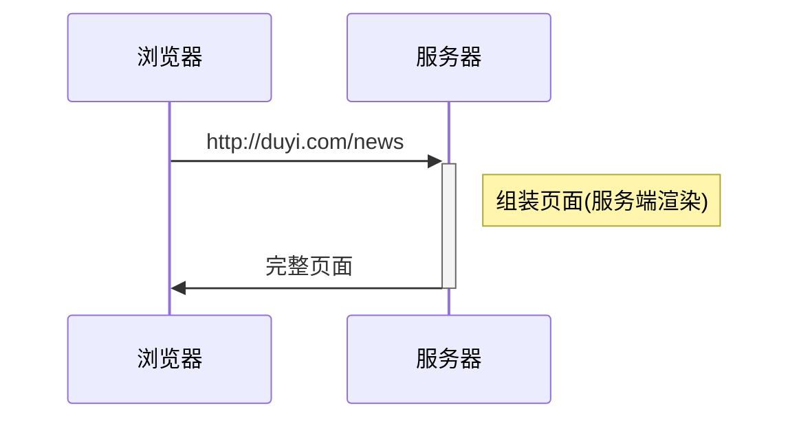
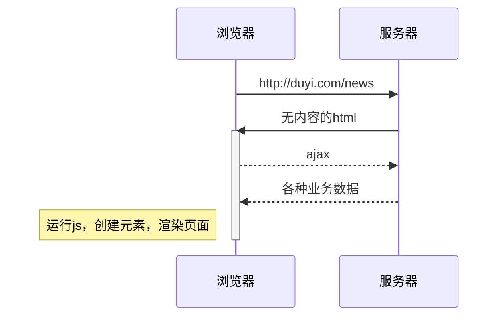
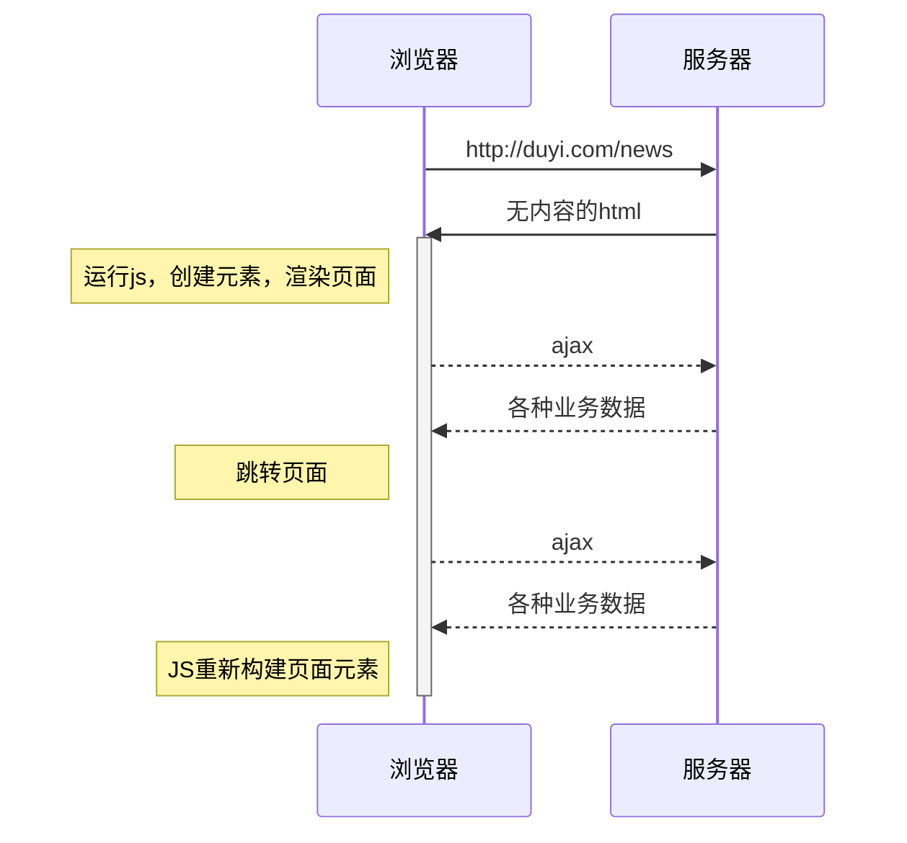
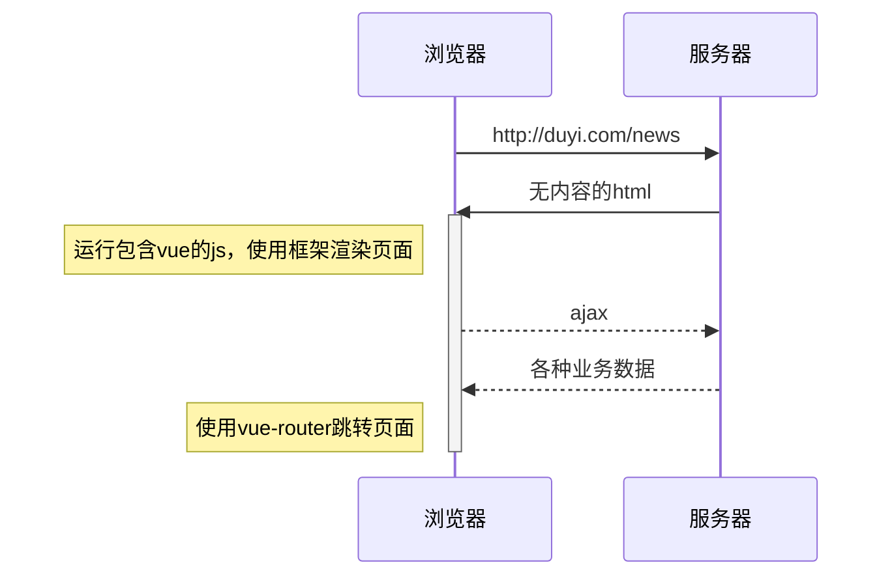
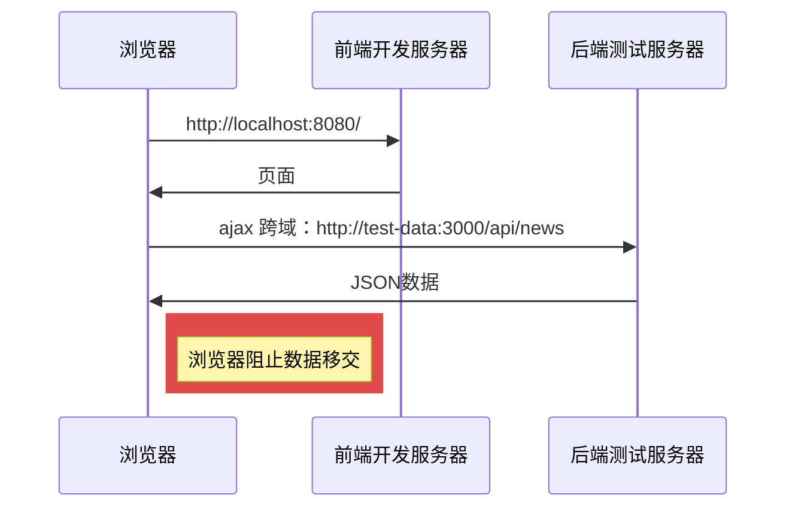
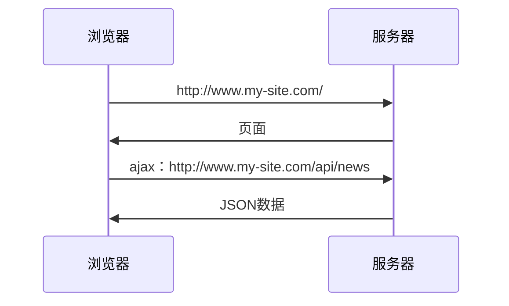
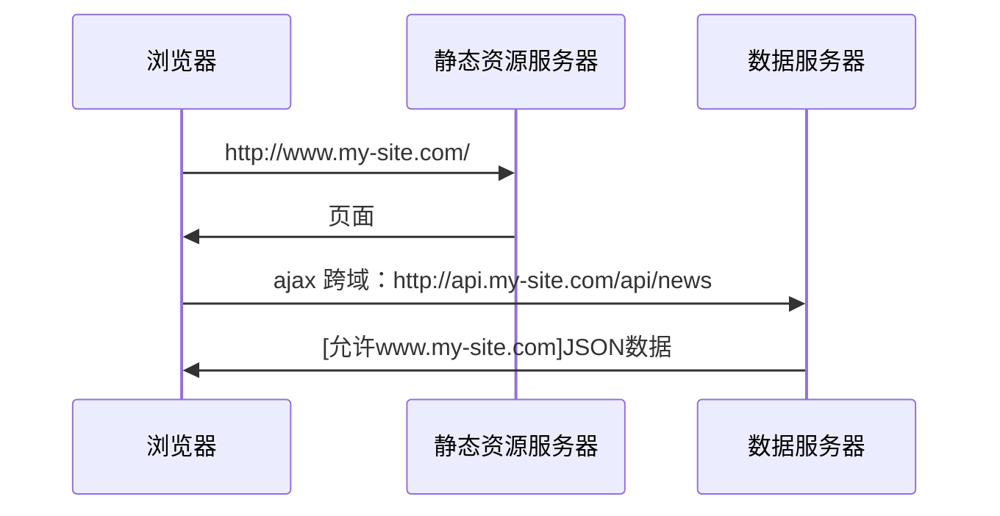
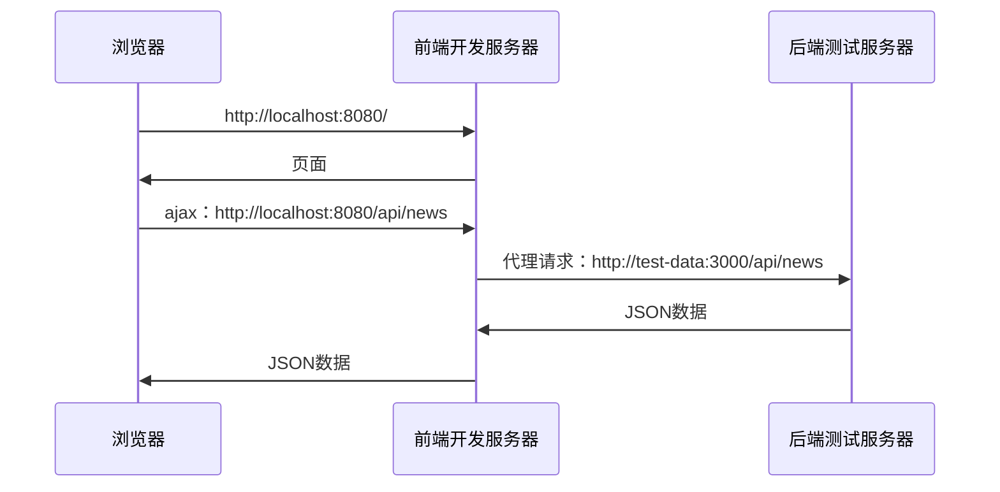
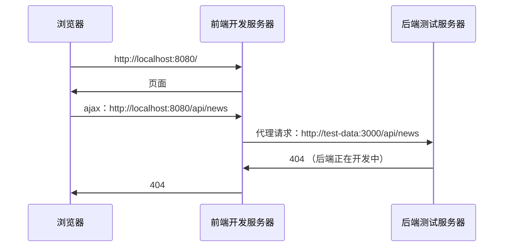
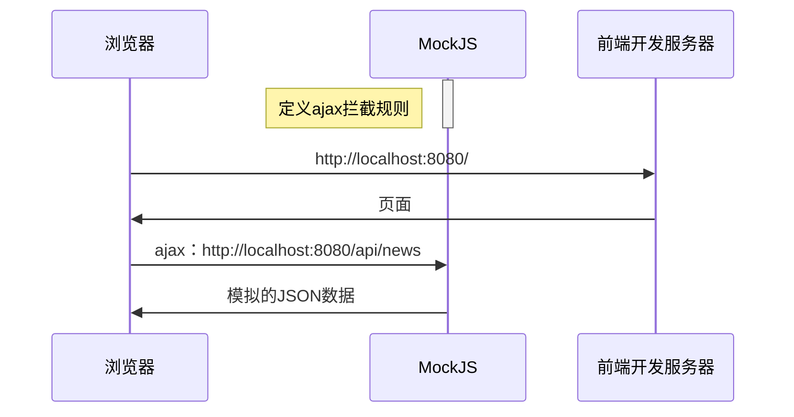

<!--
 * @Author: your name
 * @Date: 2021-06-07 16:28:01
 * @LastEditTime: 2021-07-16 21:55:21
 * @LastEditors: Please set LastEditors
 * @Description: In User Settings Edit
 * @FilePath: \VUE_learing_notes\README.md
-->
# VUE_learing_notes

## 前端框架的由来

> vue官网：https://cn.vuejs.org/

**服务端渲染**



------

**前后端分离**



---------

**单页应用**



---------

**vue框架**



## vue核心概念

### 注入


vue会将以下配置注入到vue实例：

- data：和界面相关的数据
- computed：通过已有数据计算得来的数据，将来详细讲解
- methods：方法

> 模板中可以使用vue实例中的成员

### 虚拟DOM树

直接操作真实的DOM会引发严重的效率问题，vue使用虚拟DOM（vnode）的方式来描述要渲染的内容

vnode是一个**普通的**JS对象，用于描述界面上应该有什么，比如：

```js
var vnode = {
  tag: "h1",
  children: [
    { tag: undefined, text: "第一个vue应用：Hello World"}
  ]
}
```

上面的对象描述了：

```
有一个标签名为h1的节点，它有一个子节点，该子节点是一个文本，内容为「第一个vue应用：Hello World」
```

**vue模板并不是真实的DOM，它会被编译为虚拟DOM**

```html
<div id="app">
  <h1>第一个vue应用：{{title}}</h1>
  <p>作者：{{author}}</p>
</div>
```

上面的模板会被编译为类似下面结构的虚拟DOM

```js
{
  tag: "div",
  children: [
    { tag: "h1", children: [ { text: "第一个vue应用：Hello World" } ] },
    { tag: "p", children: [ { text: "作者：袁" } ] }
  ]
}
```

虚拟DOM树会最终生成为真实的DOM树


当数据变化后，将引发重新渲染，vue会比较新旧两棵vnode tree，找出差异，然后仅把差异部分应用到真实dom tree中


**可见，在vue中，要得到最终的界面，必须要生成一个vnode tree**

vue通过以下逻辑生成vnode tree：


**注意：虚拟节点树必须是单根的**

### 挂载

将生成的真实DOM树，放置到某个元素位置，称之为**挂载**

挂载的方式：

1. 通过`el:"css选择器"`进行配置
2. 通过`vue实例.$mount("css选择器")`进行配置

### 完整流程


组件的出现是为了实现以下两个目标：

1. 降低整体复杂度，提升代码的可读性和可维护性
2. 提升局部代码的可复用性

绝大部分情况下，一个组件就是页面中某个区域，组件包含该区域的：

- 功能（JS代码）

- 内容（模板代码）

- 样式（CSS代码）

  > 要在组件中包含样式，需要构建工具的支撑

## 组件开发

#### 创建组件

组件是根据一个普通的配置对象创建的，所以要开发一个组件，只需要写一个配置对象即可

该配置对象和vue实例的配置是**几乎一样**的

```js
//组件配置对象
var myComp = {
  data(){
    return {
      // ...
    }
  },
  template: `....`
}
```

值得注意的是，组件配置对象和vue实例有以下几点差异：

- 无`el`
- `data`必须是一个函数，该函数返回的对象作为数据
- 由于没有`el`配置，组件的虚拟DOM树必须定义在`template`或`render`中


#### 注册组件

注册组件分为两种方式，一种是**全局注册**，一种是**局部注册**

###### 全局注册

一旦全局注册了一个组件，整个应用中任何地方都可以使用该组件


全局注册的方式是：

```js
// 参数1：组件名称，将来在模板中使用组件时，会使用该名称
// 参数2：组件配置对象
// 该代码运行后，即可在模板中使用组件
Vue.component('my-comp', myComp)
```

在模板中，可以使用组件了

```html
<my-comp />
<!-- 或 -->
<my-comp></my-comp>
```


> 但在一些工程化的大型项目中，很多组件都不需要全局使用。
> 比如一个登录组件，只有在登录的相关页面中使用，如果全局注册，将导致构建工具无法优化打包
> **因此，除非组件特别通用，否则不建议使用全局注册**


###### 局部注册

局部注册就是哪里要用到组件，就在哪里注册


局部注册的方式是，在要使用组件的组件或实例中加入一个配置：

```js
// 这是另一个要使用my-comp的组件
var otherComp = {
  components:{
    // 属性名为组件名称，模板中将使用该名称
    // 属性值为组件配置对象
    "my-comp": myComp
  },
  template: `
    <div>
      <!-- 该组件的其他内容 -->
      <my-comp></my-comp>
    </div>
  `;
}
```

### 应用组件

在模板中使用组件特别简单，把组件名当作HTML元素名使用即可。

但要注意以下几点：

1. **组件必须有结束**

组件可以自结束，也可以用结束标记结束，但必须要有结束

下面的组件使用是错误的：

```html
<my-comp>
```

2. **组件的命名**

无论你使用哪种方式注册组件，组件的命名需要遵循规范。

组件可以使用`kebab-case 短横线命名法`，也可以使用`PascalCase 大驼峰命名法`

下面两种命名均是可以的

```js
var otherComp = {
  components:{
    "my-comp": myComp,  // 方式1
    MyComp: myComp //方式2
  }
}
```

> 实际上，使用`小驼峰命名法 camelCase`也是可以识别的，只不过不符合官方要求的规范

使用`PascalCase`方式命名还有一个额外的好处，即可以在模板中使用两种组件名

```js
var otherComp = {
  components:{
    MyComp: myComp
  }
}
```

模板中：

```html
<!-- 可用 -->
<my-comp />
<MyComp />
```

因此，在使用组件时，为了方便，往往使用以下代码：

```js
var MyComp = {
  //组件配置
}

var OtherComp = {
  components:{
    MyComp // ES6速写属性
  }
}
```


### 组件树

一个组件创建好后，往往会在各种地方使用它。它可能多次出现在vue实例中，也可能出现在其他组件中。

于是就形成了一个组件树


### 向组件传递数据

大部分组件要完成自身的功能，都需要一些额外的信息

比如一个头像组件，需要告诉它头像的地址，这就需要在使用组件时向组件传递数据

传递数据的方式有很多种，最常见的一种是使用**组件属性 component props**

首先在组件中申明可以接收哪些属性:

```js
var MyComp = {
  props:["p1", "p2", "p3"],
  // 和vue实例一样，使用组件时也会创建组件的实例
  // 而组件的属性会被提取到组件实例中，因此可以在模板中使用
  template: `
    <div>
      {{p1}}, {{p2}}, {{p3}}
    </div>
  `
}
```

在使用组件时，向其传递属性：

```js
var OtherComp = {
  components: {
    MyComp
  },
  data(){
    return {
      a:1
    }
  },
  template: `
    <my-comp :p1="a" :p2="2" p3="3"/>
  `
}
```

**注意：在组件中，属性是只读的，绝不可以更改，这叫做单向数据流**


## 搭建工程
### 工程结构

见代码

> vue-cli: https://cli.vuejs.org/zh/

### vue-cli

`vue-cli`是一个脚手架工具，用于搭建`vue`工程

它内部使用了`webpack`，并预置了诸多插件（`plugin`）和加载器（`loader`），以达到开箱即用的效果

除了基本的插件和加载器外，`vue-cli`还预置了：

- babel
- webpack-dev-server
- eslint
- postcss
- less-loader

### SFC

单文件组件，Single File Component，即一个文件就包含了一个组件所需的全部代码

```html
<template>
	<!-- 组件模板代码 -->
</template>

<script>
export default {
  // 组件配置
}
</script>

<style>
	/* 组件样式 */
</style>
```


### 预编译

当`vue-cli`进行**打包**时，会直接把组件中的模板转换为`render`函数，这叫做模板预编译

这样做的好处在于：

1. 运行时就不再需要编译模板了，提高了运行效率
2. 打包结果中不再需要vue的编译代码，减少了打包体积


## 计算属性
面试题：计算属性和方法有什么区别？

```
计算属性本质上是包含getter和setter的方法
当获取计算属性时，实际上是在调用计算属性的getter方法。vue会收集计算属性的依赖，并缓存计算属性的返回结果。只有当依赖变化后才会重新进行计算。
方法没有缓存，每次调用方法都会导致重新执行。
计算属性的getter和setter参数固定，getter没有参数，setter只有一个参数。而方法的参数不限。
由于有以上的这些区别，因此计算属性通常是根据已有数据得到其他数据，并在得到数据的过程中不建议使用异步、当前时间、随机数等副作用操作。
实际上，他们最重要的区别是含义上的区别。计算属性含义上也是一个数据，可以读取也可以赋值；方法含义上是一个操作，用于处理一些事情。
```


完整的计算属性书写：

```js
computed: {
  propName: {
    get(){
      // getter
    },
    set(val){
      // setter
    }
  }
}
```

只包含getter的计算属性简写：

```js
computed: {
  propName(){
    // getter
  }
}
```

## 组件事件
### pager组件


#### 属性

| 属性名        | 含义       | 类型   | 必填 | 默认值 |
| ------------- | ---------- | ------ | ---- | ------ |
| current       | 当前页码   | Number | 否   | 1      |
| total         | 总数据量   | Number | 否   | 0      |
| limit         | 页容量     | Number | 否   | 10     |
| visibleNumber | 可见页码数 | Number | 否   | 10     |

#### 事件

| 事件名     | 含义     | 事件参数 | 参数类型 |
| ---------- | -------- | -------- | -------- |
| pageChange | 页码变化 | 新的页码 | Number   |

### 知识点

1. **全局样式**

2. **v-if 和 v-show**

   

   -------

   

   **面试题：v-if 和 v-show 有什么区别？**

   ```
   v-if能够控制是否生成vnode，也就间接控制了是否生成对应的dom。当v-if为true时，会生成对应的vnode，并生成对应的dom元素；当其为false时，不会生成对应的vnode，自然不会生成任何的dom元素。
   v-show始终会生成vnode，也就间接导致了始终生成dom。它只是控制dom的display属性，当v-show为true时，不做任何处理；当其为false时，生成的dom的display属性为none。
   使用v-if可以有效的减少树的节点和渲染量，但也会导致树的不稳定；而使用v-show可以保持树的稳定，但不能减少树的节点和渲染量。
   因此，在实际开发中，显示状态变化频繁的情况下应该使用v-show，以保持树的稳定；显示状态变化较少时应该使用v-if，以减少树的节点和渲染量。
   ```

   

3. **组件事件**

   

   抛出事件：子组件在某个时候发生了一件事，但自身无法处理，于是通过事件的方式通知父组件处理

   事件参数：子组件抛出事件时，传递给父组件的数据

   注册事件：父组件申明，当子组件发生某件事的时候，自身将做出一些处理


## 优化工程结构
### 如何使用组件？

编写组件说明文档

```
./src/components/README.md
```

### 如何测试组件效果？

https://cli.vuejs.org/zh/guide/prototyping.html

## 插槽
在某些组件的模板中，有一部分区域需要父组件来指定

```html
<!-- message组件：一个弹窗消息 -->
<div class="message-container">
  <div class="content">
    <!-- 这里是消息内容，可以是一个文本，也可能是一段html，具体是什么不知道，需要父组件指定 -->
  </div>
  <button>确定</button>
  <button>关闭</button>
</div>
```

### 插槽的简单用法

此时，就需要使用插槽来定制组件的功能

```html
<!-- message组件：一个弹窗消息 -->
<div class="message-container">
  <div class="content">
    <!-- slot是vue的内置组件 -->
    <slot></slot>
  </div>
  <button>确定</button>
  <button>关闭</button>
</div>

<!-- 父组件App -->
<Message>
	<div class="app-message">
    <p>App Message</p>
    <a href="">detail</a>
  </div>
</Message>

<!-- 最终的结果 -->
<div class="message-container">
  <div class="content">
    <div class="app-message">
      <p>App Message</p>
      <a href="">detail</a>
    </div>
  </div>
  <button>确定</button>
  <button>关闭</button>
</div>
```


### 具名插槽

如果某个组件中需要父元素传递多个区域的内容，也就意味着需要提供多个插槽

为了避免冲突，就需要给不同的插槽赋予不同的名字

```html
<!-- Layout 组件 -->
<div class="layout-container">
  <header>
    <!-- 我们希望把页头放这里，提供插槽，名为header -->
    <slot name="header"></slot>
  </header>
  <main>
    <!-- 我们希望把主要内容放这里，提供插槽，名为default -->
    <slot></slot>
  </main>
  <footer>
    <!-- 我们希望把页脚放这里，提供插槽，名为footer -->
    <slot name="footer"></slot>
  </footer>
</div>

<!-- 父组件App -->
<BaseLayout>
  <template v-slot:header>
    <h1>Here might be a page title</h1>
  </template>

  <template v-slot:default>
    <p>A paragraph for the main content.</p>
    <p>And another one.</p>
  <template v-slot:default>
    
  <template v-slot:footer>
    <p>Here's some contact info</p>
  </template>
</BaseLayout>
```


## 路由
> vue-router官网：https://router.vuejs.org/zh/


1. **如何根据地址中的路径选择不同的组件？**
2. **把选择的组件放到哪个位置？**
3. **如何无刷新的切换组件？**


### 路由插件

```shell
npm i vue-router
```

路由插件的使用

```js
import Vue from 'vue'
import VueRouter from 'vue-router'

Vue.use(VueRouter); // Vue.use(插件)  在Vue中安装插件

const router = new VueRouter({
  // 路由配置
})
new Vue({
  ...,
  router
})
```

### 基本使用

```js
// 路由配置
const router = new VueRouter({
  routes: [ // 路由规则
    // 当匹配到路径 /foo 时，渲染 Foo 组件
    { path: '/foo', component: Foo },
    // 当匹配到路径 /bar 时，渲染 Bar 组件
  	{ path: '/bar', component: Bar }
  ]
})
```


```html
<!-- App.vue -->
<div class="container">
  <div>
    <!-- 公共区域 -->
  </div>
  <div>
    <!-- 页面区域 -->
    <!-- vue-router 匹配到的组件会渲染到这里 -->
    <RouterView />
  </div>
</div>
```


### 路由模式

路由模式决定了：

1. 路由从哪里获取访问路径
2. 路由如何改变访问路径

`vue-router`提供了三种路由模式：

1. hash：默认值。路由从浏览器地址栏中的hash部分获取路径，改变路径也是改变的hash部分。该模式兼容性最好。

   ```
   http://localhost:8081/#/blog  -->  /blog
   http://localhost:8081/about#/blog  --> /blog
   ```

2. history：路由从浏览器地址栏的`location.pathname`中获取路径，改变路径使用的H5的`history api`。该模式可以让地址栏最友好，但是需要浏览器支持`history api`

   ```
   http://localhost:8081/#/blog  -->  /
   http://localhost:8081/about#/blog  --> /about
   http://localhost:8081/blog  --> /blog
   ```

3. abstract：路由从内存中获取路径，改变路径也只是改动内存中的值。这种模式通常应用到非浏览器环境中。

   ```shell
   内存： /			-->   /
   内存： /about	--> /about
   内存： /blog	  --> /blog
   ```

### 导航

`vue-router`提供了全局的组件`RouterLink`，它的渲染结果是一个`a`元素

```html
<RouterLink to="/blog">文章</RouterLink>
<!-- mode:hash 生成 -->
<a href="#/blog">文章</a>
<!-- mode:history 生成 -->
<!-- 为了避免刷新页面，vue-router实际上为它添加了点击事件，并阻止了默认行为，在事件内部使用hitory api更改路径 -->
<a href="/blog">文章</a>
```


#### 激活状态

默认情况下，`vue-router`会用 **当前路径** 匹配 **导航路径** ：

- 如果当前路径是以导航路径开头，则算作匹配，会为导航的a元素添加类名`router-link-active`
- 如果当前路径完全等于导航路径，则算作精确匹配，会为导航的a元素添加类名`router-link-exact-active`


例如，当前访问的路径是`/blog`，则：

| 导航路径 | 类名                                          |
| -------- | --------------------------------------------- |
| /        | router-link-active                            |
| /blog    | router-link-active   router-link-exact-active |
| /about   | 无                                            |
| /message | 无                                            |


可以为组件`RouterLink`添加bool属性`exact`，将匹配规则改为：必须要精确匹配才能添加匹配类名`router-link-active`


例如，当前访问的路径是`/blog`，则：

| 导航路径 | exact | 类名                                          |
| -------- | ----- | --------------------------------------------- |
| /        | true  | 无                                            |
| /blog    | false | router-link-active   router-link-exact-active |
| /about   | true  | 无                                            |
| /message | true  | 无                                            |

例如，当前访问的路径是`/blog/detail/123`，则：

| 导航路径 | exact | 类名               |
| -------- | ----- | ------------------ |
| /        | true  | 无                 |
| /blog    | false | router-link-active |
| /about   | true  | 无                 |
| /message | true  | 无                 |


另外，可以通过`active-class`属性更改匹配的类名，通过`exact-active-class`更改精确匹配的类名


### 命名路由

使用命名路由可以解除系统与路径之间的耦合

```js
// 路由配置
const router = new VueRouter({
  routes: [ // 路由规则
    // 当匹配到路径 /foo 时，渲染 Foo 组件
    { name:"foo", path: '/foo', component: Foo },
    // 当匹配到路径 /bar 时，渲染 Bar 组件
  	{ name:"bar", path: '/bar', component: Bar }
  ]
})

```

```html
<!-- 向to属性传递路由信息对象 RouterLink会根据你传递的信息以及路由配置生成对应的路径 -->
<RouterLink :to="{ name:'foo' }">go to foo</RouterLink>
```
## 弹出消息
### 使用css module

需要将样式文件命名为`xxx.module.ooo`

`xxx`为文件名

`ooo`为样式文件后缀名，可以是`css`、`less`


### 得到组件渲染的Dom

```js
  /**
    获取某个组件渲染的Dom根元素
  */
function getComponentRootDom(comp, props){
  const vm = new Vue({
    render: h => h(comp, {props})
  })
  vm.$mount();
  return vm.$el;
}
```


### 扩展vue实例


### ref

```html
<template>
	<div>
    <p ref="para">some paragraph</p>
    <ChildComp ref="comp" />
    <button @click="handleClick">查看所有引用</button>
  </div>
</template>

<script>
  import ChildComp from "./ChildComp"
	export default {
    components:{
      ChildComp
    },
    methods:{
      handleClick(){
        // 获取持有的所有引用
        console.log(this.$refs);
        /*
        {
        	para: p元素（原生DOM）,
        	comp: ChildComp的组件实例
        }
        */
      }
    }
  }
</script>
```


> 通过`ref`可以直接操作`dom`元素，甚至可能直接改动子组件，这些都不符合`vue`的设计理念。
>
> 除非迫不得已，否则不要使用`ref`

## 获取远程数据
> 本节课内容和vue没有任何关系！
>
> vue cli: https://cli.vuejs.org/zh/
>
> axios: https://github.com/axios/axios
>
> mockjs：http://mockjs.com/

### 远程获取数据的意义


### 开发环境有跨域问题



### 生产环境没有跨域问题





### 解决开发环境的跨域问题



### 为什么要Mock数据





## 组件生命周期


### 常见应用

> 不要死记硬背，要根据具体情况灵活处理

#### 加载远程数据

```js
export default {
  data(){
    return {
      news: []
    }
  },
  async created(){
    this.news = await getNews();
  }
}
```

#### 直接操作DOM

```js
export default {
  data(){
    return {
      containerWidth:0,
    	containerHeight:0
    }
  },
  mounted(){
    this.containerWidth = this.$refs.container.clientWidth;
    this.containerHeight = this.$refs.container.containerHeight;
  }
}
```

#### 启动和清除计时器

```js
export default {
  data(){
    return {
      timer: null
    }
  },
  created(){
    this.timer = setInterval(()=>{
     ... 
    }, 1000)
  },
  destroyed(){
    clearInterval(this.timer);               
  }
}
```

## 首页part1
`Home`组件负责呈现整体效果

`CarouselItem`组件负责呈现单张轮播图


`Home`组件负责：

- 整体布局
- 监听鼠标滚轮事件，切换轮播图
- 提供上下按钮，切换轮播图
- 提供指示器，切换轮播图

`CarouselItem`组件负责：

- 单张轮播图的全部事务

## 定义指令

### 全局定义

```js
// 指令名称为：mydirec1
Vue.directive('mydirec1', {
  // 指令配置
})

// 指令名称为：mydirec2
Vue.directive('mydirec2', {
  // 指令配置
})
```

之后，所有的组件均可以使用`mydirec1`和`mydirec2`指令

```vue
<template>
  <!-- 某个组件代码 -->
  <div>
    <MyComp v-mydirec1="js表达式" />
    <div v-mydirec2="js表达式">
      ...
    </div>
    
  </div>
</template>
```

### 局部定义

局部定义是指在某个组件中定义指令，和局部注册组件类似。

定义的指令仅在该组件中有效。

```vue
<template>
  <!-- 某个组件代码 -->
  <div>
    <MyComp v-mydirec1="js表达式" />
    <div v-mydirec2="js表达式">
      ...
    </div>
    
  </div>
</template>

<script>
export default {
  // 定义指令
  directives: {
    // 指令名称：mydirec1
    mydirec1: {
      // 指令配置
    },
    // 指令名称：mydirec2
    mydirec2: {
      // 指令配置
    }
  }
}
</script>
```

和局部注册组件一样，为了让指令更加通用，通常我们会把指令的配置提取到其他模块。

```vue
<template>
  <!-- 某个组件代码 -->
  <div>
    <MyComp v-mydirec1="js表达式" />
    <div v-mydirec2="js表达式">
      ...
    </div>
    
  </div>
</template>

<script>
  // 导入当前组件需要用到的指令配置对象
  import mydirec1 from "@/directives/mydirec1";
  import mydirec2 from "@/directives/mydirec2";
	export default {
    // 定义指令
    directives: {
      mydirec1,
      mydirec2
    }
  }
</script>
```

### 指令配置对象

没有配置的指令，就像没有配置的组件一样，毫无意义

`vue`支持在指令中配置一些**钩子函数**，在适当的时机，`vue`会调用这些钩子函数并传入适当的参数，以便开发者完成自己想做的事情。

常用的钩子函数：

```js
// 指令配置对象
{
  bind(){
    // 只调用一次，指令第一次绑定到元素时调用。在这里可以进行一次性的初始化设置。
  },
  inserted(){
    // 被绑定元素插入父节点时调用。
  },
  update(){
    // 所在组件的 VNode 更新时调用
  }
}
```

>  [查看更多的钩子函数](https://cn.vuejs.org/v2/guide/custom-directive.html#%E9%92%A9%E5%AD%90%E5%87%BD%E6%95%B0)

每个钩子函数在调用时，`vue`都会向其传递一些参数，其中最重要的是前两个参数

```js
// 指令配置对象
{
  bind(el, binding){
    // el 是被绑定元素对应的真实DOM
    // binding 是一个对象，描述了指令中提供的信息
  }
}
```

#### bingding 对象


> [查看更多bingding对象的属性](https://cn.vuejs.org/v2/guide/custom-directive.html#%E9%92%A9%E5%AD%90%E5%87%BD%E6%95%B0%E5%8F%82%E6%95%B0)

### 配置简化

比较多的时候，在配置自定义指令时，我们都会配置两个钩子函数

```js
{
  bind(el, bingding){
    
  },
  update(el, bingding){
    
  }
}
```

这样，在元素绑定和更新时，都能运行到钩子函数

如果这两个钩子函数实现的功能相同，可以直接把指令配置简化为一个单独的函数：

```js
function(el, bingding){
  // 该函数会被同时设置到bind和update中
}
```


> 利用上述知识，可满足大部分自定义指令的需求
>
> 更多的自定义指令用法见[官网](https://cn.vuejs.org/v2/guide/custom-directive.html)

## 组件混入
有的时候，许多组件有着类似的功能，这些功能代码分散在组件不同的配置中。


于是，我们可以把这些配置代码抽离出来，利用**混入**融合到组件中。


具体的做法非常简单：

```js
// 抽离的公共代码
const common = {
  data(){
    return {
      a: 1,
      b: 2
    }
  },
  created(){
    console.log("common created");
  },
  computed:{
    sum(){
      return this.a + this.b;
    }
  }
}

/**
 * 使用comp1，将会得到：
 * common created
 * comp1 created 1 2 3
 */
const comp1 = {
  mixins: [common] // 之所以是数组，是因为可以混入多个配置代码
  created(){
    console.log("comp1 created", this.a, this.b, this.sum);
  }
}
```

混入并不复杂，更多细节参见[官网](https://cn.vuejs.org/v2/guide/mixins.html)

## 文字列表页
### 文章列表页逻辑

#### 路由跳转逻辑


#### 组件逻辑


##### BlogList


##### BlogCategory


### 知识

#### 动态路由

我们希望下面的地址都能够匹配到`Blog`组件

- `/article`，显示全部文章
- `/article/cate/1`，显示分类`id`为`1`的文章
- `/article/cate/3`，显示分类`id`为`3`的文章
- ...

第一种情况很简单，只需要将一个固定的地址匹配到`Blog`组件即可

```js
{
  path: "/article",
  name: "Blog",
  component: Blog
}
```

但后面的情况则不同：匹配到`Blog`组件的地址中，有一部分是动态变化的，则需要使用一种特殊的表达方式：

```js
{
  path: "/article/cate/:categoryId",
  name: "CategoryBlog",
  component: Blog
}
```

在地址中使用`:xxx`，来表达这一部分的内容是变化的，在`vue-router`中，将变化的这一部分称之为`params`，可以在`vue`组件中通过`this.$route.params`来获取

```js
// 访问 /article/cate/3
this.$route.params // { categoryId: "3" }
// 访问 /article/cate/1
this.$route.params // { categoryId: "1" }
```

##### 动态路由的导航

```vue
<router-link to="/article/cate/3">to article of category 3</router-link>

<router-link :to="{
   name: 'CategoryBlog',
   params: {
       categoryId: 3           
   }                    
}">to article of category 3</router-link>
```

#### 编程式导航

除了使用`<RouterLink>`超链接导航外，`vue-router`还允许在代码中跳转页面

```js
this.$router.push("跳转地址"); // 普通跳转
this.$router.push({ // 命名路由跳转
  name:"Blog"
})

this.$router.go(-1); // 回退。类似于 history.go
```

#### watch

利用`watch`配置，可以直接观察某个数据的变化，变化时可以做一些处理

```js
export default {
  // ... 其他配置
  watch: {
    // 观察 this.$route 的变化，变化后，会调用该函数
    $route(newVal, oldVal){
      // newVal：this.$route 新的值，等同 this.$route
      // oldVal：this.$route 旧的值
    },
    // 完整写法
    $route: {
      handler(newVal, oldVal){},
      deep: false, // 是否监听该数据内部属性的变化，默认 false
      immediate: false // 是否立即执行一次 handler，默认 false
    }
    // 观察 this.$route.params 的变化，变化后，会调用该函数
    ["$route.params"](newVal, oldVal){
      // newVal：this.$route.params 新的值，等同 this.$route.params
      // oldVal：this.$route.params 旧的值
    },
  	// 完整写法
    ["$route.params"]: {
      handler(newVal, oldVal){},
      deep: false, // 是否监听该数据内部属性的变化，默认 false
      immediate: false // 是否立即执行一次 handler，默认 false
    }
  }
}
```
## 文章详情页
### 文章数据逻辑


### 组件逻辑


#### BlogDetail

该组件没有任何难度，根据「属性 - 文章对象」显示出文章信息即可

由于文章的内容属于**原始html**，因此需要使用`v-html`指令来设置

另外，文章的内容是不带样式的，因此需要选择一款`markdown`的`css`样式（见附件`markdown.css`）

对于文章中脚本部分的样式，可以使用第三方库[highlight.js](https://highlightjs.org/)中提供的样式

```js
import "highlight.js/styles/github.css";
```


#### BlogTOC

无难度，不解释

#### BlogComment

下节课讲解


