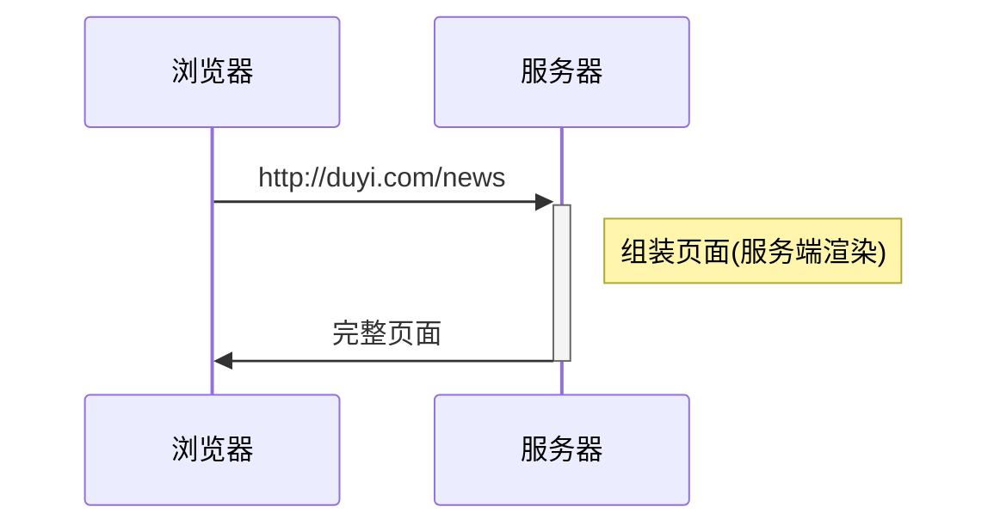
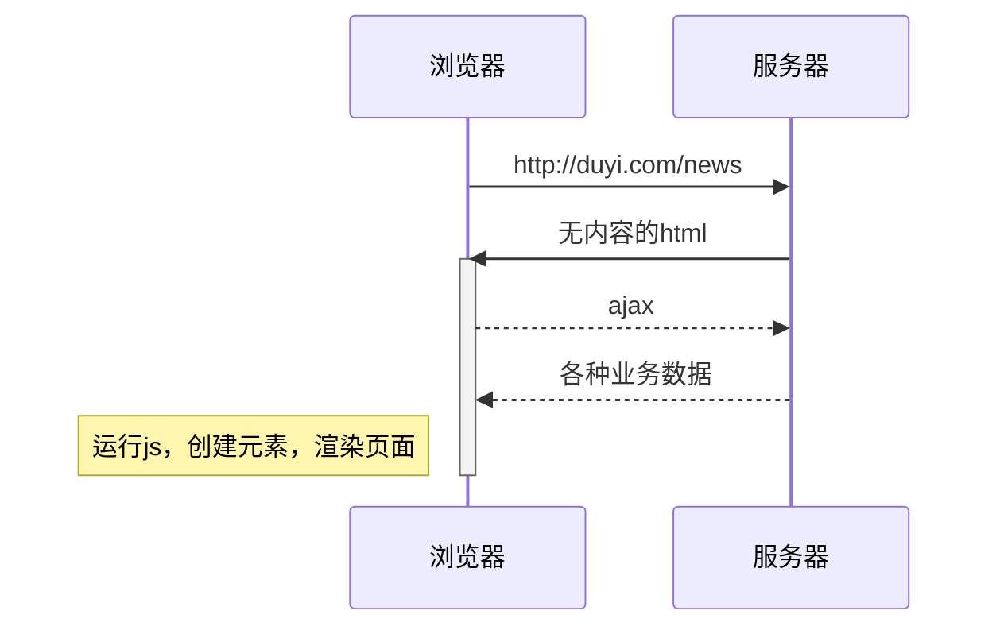
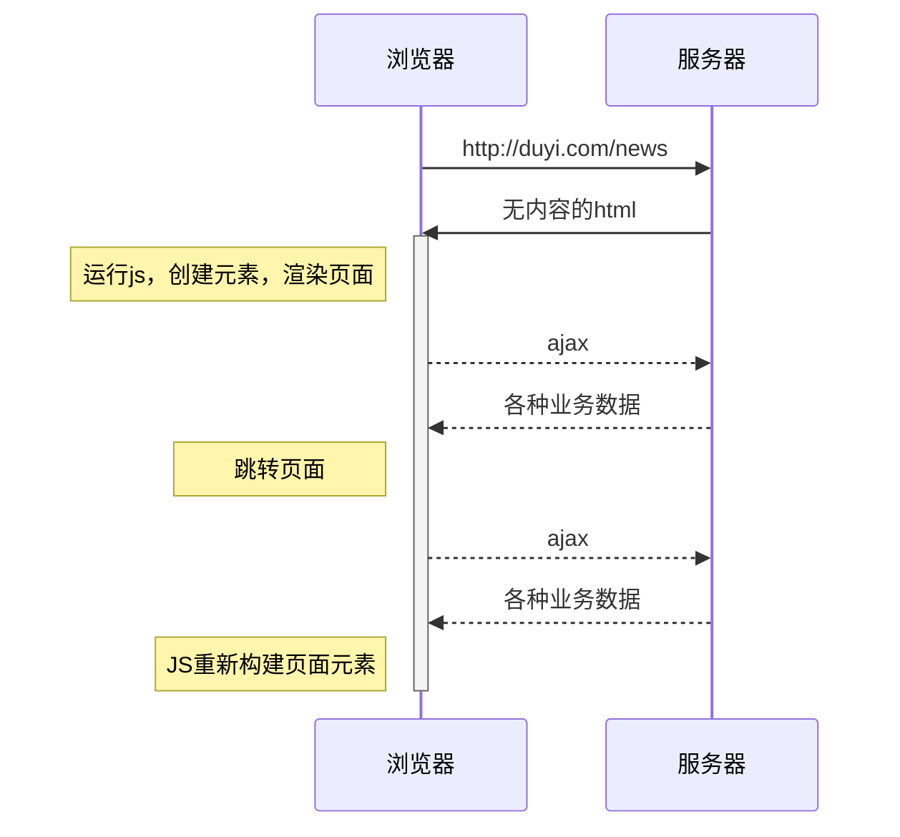
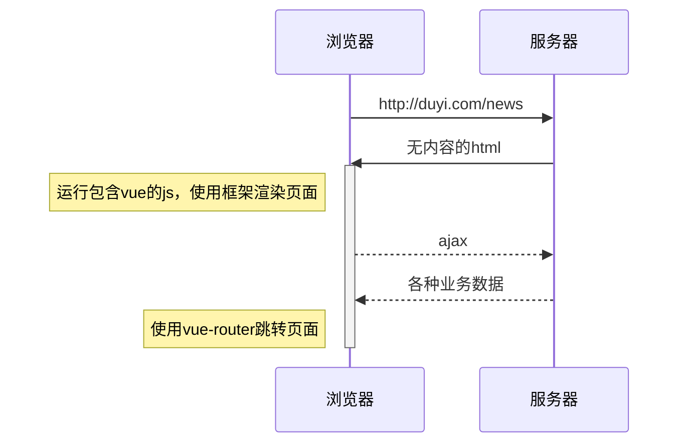
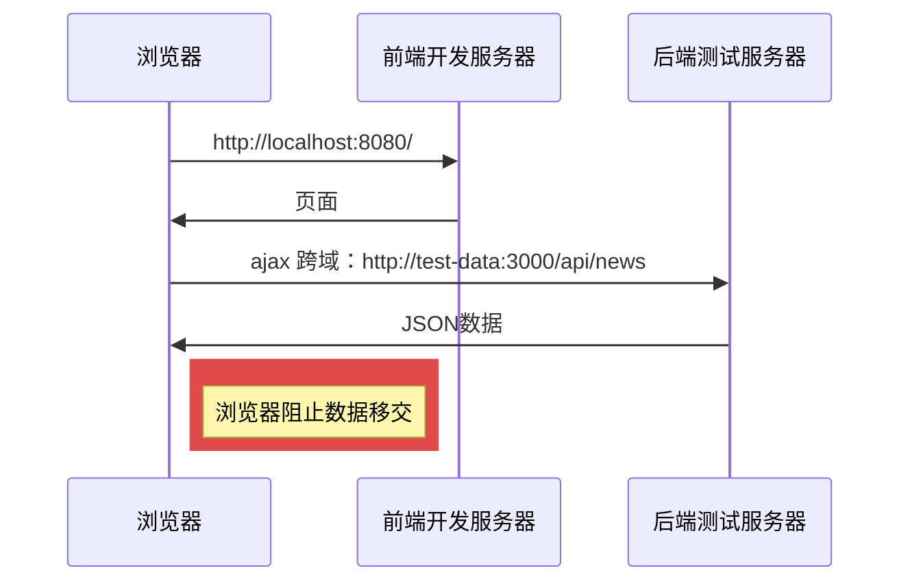
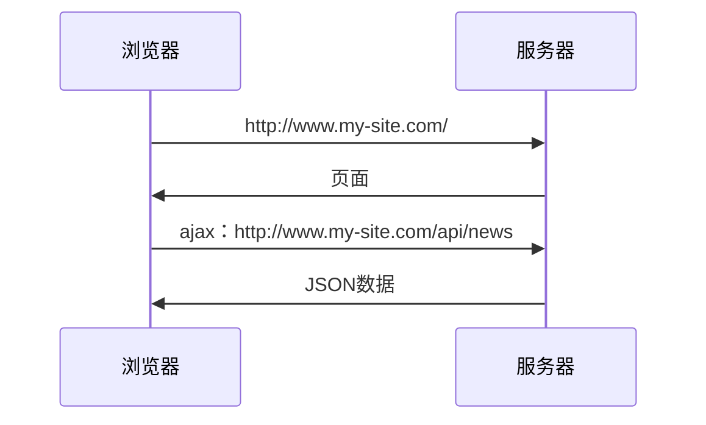
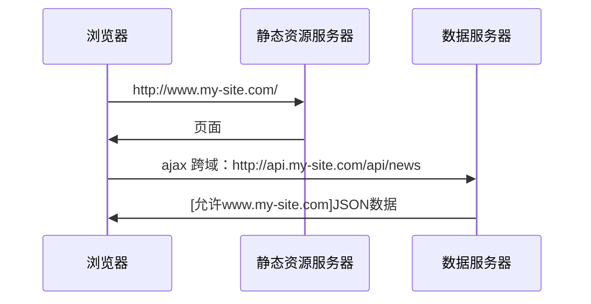
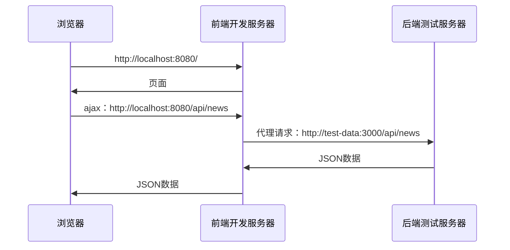
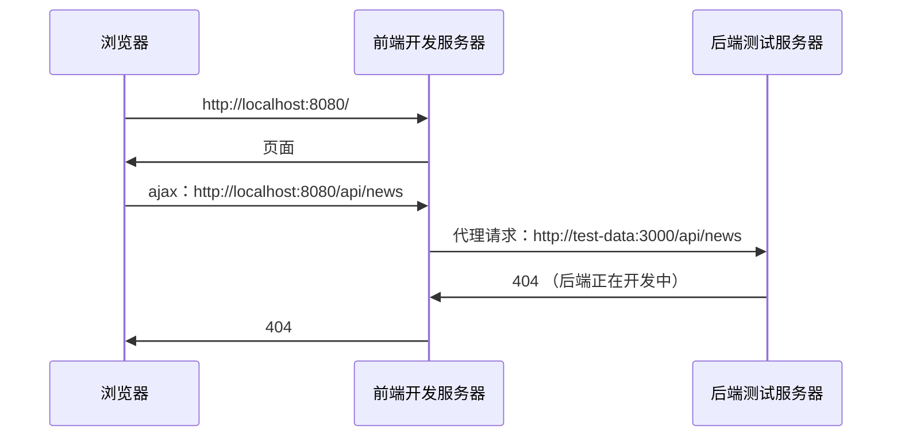
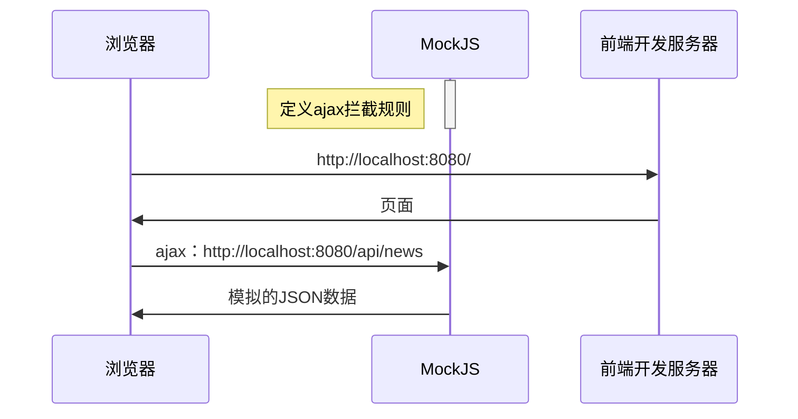

<!--
 * @Author: your name
 * @Date: 2021-06-07 16:28:01
 * @LastEditTime: 2021-07-28 17:49:42
 * @LastEditors: Please set LastEditors
 * @Description: In User Settings Edit
 * @FilePath: \VUE_learing_notes\README.md
-->

# VUE_learning_notes

## 前端框架的由来

> vue官网：<https://cn.vuejs.org/>

**服务端渲染**



------

**前后端分离**



---------

**单页应用**



---------

**vue框架**



## vue核心概念

### 注入


vue会将以下配置注入到vue实例：

- data：和界面相关的数据
- computed：通过已有数据计算得来的数据，将来详细讲解
- methods：方法

> 模板中可以使用vue实例中的成员

### 虚拟DOM树

直接操作真实的DOM会引发严重的效率问题，vue使用虚拟DOM（vnode）的方式来描述要渲染的内容

vnode是一个**普通的**JS对象，用于描述界面上应该有什么，比如：

```js
var vnode = {
  tag: "h1",
  children: [
    { tag: undefined, text: "第一个vue应用：Hello World"}
  ]
}
```

上面的对象描述了：

```
有一个标签名为h1的节点，它有一个子节点，该子节点是一个文本，内容为「第一个vue应用：Hello World」
```

**vue模板并不是真实的DOM，它会被编译为虚拟DOM**

```html
<div id="app">
  <h1>第一个vue应用：{{title}}</h1>
  <p>作者：{{author}}</p>
</div>
```

上面的模板会被编译为类似下面结构的虚拟DOM

```js
{
  tag: "div",
  children: [
    { tag: "h1", children: [ { text: "第一个vue应用：Hello World" } ] },
    { tag: "p", children: [ { text: "作者：袁" } ] }
  ]
}
```

虚拟DOM树会最终生成为真实的DOM树


当数据变化后，将引发重新渲染，vue会比较新旧两棵vnode tree，找出差异，然后仅把差异部分应用到真实dom tree中


**可见，在vue中，要得到最终的界面，必须要生成一个vnode tree**

vue通过以下逻辑生成vnode tree：


**注意：虚拟节点树必须是单根的**

### 挂载

将生成的真实DOM树，放置到某个元素位置，称之为**挂载**

挂载的方式：

1. 通过`el:"css选择器"`进行配置
2. 通过`vue实例.$mount("css选择器")`进行配置

### 完整流程


组件的出现是为了实现以下两个目标：

1. 降低整体复杂度，提升代码的可读性和可维护性
2. 提升局部代码的可复用性

绝大部分情况下，一个组件就是页面中某个区域，组件包含该区域的：

- 功能（JS代码）

- 内容（模板代码）

- 样式（CSS代码）

  > 要在组件中包含样式，需要构建工具的支撑

## 组件开发

#### 创建组件

组件是根据一个普通的配置对象创建的，所以要开发一个组件，只需要写一个配置对象即可

该配置对象和vue实例的配置是**几乎一样**的

```js
//组件配置对象
var myComp = {
  data(){
    return {
      // ...
    }
  },
  template: `....`
}
```

值得注意的是，组件配置对象和vue实例有以下几点差异：

- 无`el`
- `data`必须是一个函数，该函数返回的对象作为数据
- 由于没有`el`配置，组件的虚拟DOM树必须定义在`template`或`render`中

#### 注册组件

注册组件分为两种方式，一种是**全局注册**，一种是**局部注册**

###### 全局注册

一旦全局注册了一个组件，整个应用中任何地方都可以使用该组件


全局注册的方式是：

```js
// 参数1：组件名称，将来在模板中使用组件时，会使用该名称
// 参数2：组件配置对象
// 该代码运行后，即可在模板中使用组件
Vue.component('my-comp', myComp)
```

在模板中，可以使用组件了

```html
<my-comp />
<!-- 或 -->
<my-comp></my-comp>
```

> 但在一些工程化的大型项目中，很多组件都不需要全局使用。
> 比如一个登录组件，只有在登录的相关页面中使用，如果全局注册，将导致构建工具无法优化打包
> **因此，除非组件特别通用，否则不建议使用全局注册**

###### 局部注册

局部注册就是哪里要用到组件，就在哪里注册


局部注册的方式是，在要使用组件的组件或实例中加入一个配置：

```js
// 这是另一个要使用my-comp的组件
var otherComp = {
  components:{
    // 属性名为组件名称，模板中将使用该名称
    // 属性值为组件配置对象
    "my-comp": myComp
  },
  template: `
    <div>
      <!-- 该组件的其他内容 -->
      <my-comp></my-comp>
    </div>
  `;
}
```

### 应用组件

在模板中使用组件特别简单，把组件名当作HTML元素名使用即可。

但要注意以下几点：

1. **组件必须有结束**

组件可以自结束，也可以用结束标记结束，但必须要有结束

下面的组件使用是错误的：

```html
<my-comp>
```

2. **组件的命名**

无论你使用哪种方式注册组件，组件的命名需要遵循规范。

组件可以使用`kebab-case 短横线命名法`，也可以使用`PascalCase 大驼峰命名法`

下面两种命名均是可以的

```js
var otherComp = {
  components:{
    "my-comp": myComp,  // 方式1
    MyComp: myComp //方式2
  }
}
```

> 实际上，使用`小驼峰命名法 camelCase`也是可以识别的，只不过不符合官方要求的规范

使用`PascalCase`方式命名还有一个额外的好处，即可以在模板中使用两种组件名

```js
var otherComp = {
  components:{
    MyComp: myComp
  }
}
```

模板中：

```html
<!-- 可用 -->
<my-comp />
<MyComp />
```

因此，在使用组件时，为了方便，往往使用以下代码：

```js
var MyComp = {
  //组件配置
}

var OtherComp = {
  components:{
    MyComp // ES6速写属性
  }
}
```

### 组件树

一个组件创建好后，往往会在各种地方使用它。它可能多次出现在vue实例中，也可能出现在其他组件中。

于是就形成了一个组件树


### 向组件传递数据

大部分组件要完成自身的功能，都需要一些额外的信息

比如一个头像组件，需要告诉它头像的地址，这就需要在使用组件时向组件传递数据

传递数据的方式有很多种，最常见的一种是使用**组件属性 component props**

首先在组件中申明可以接收哪些属性:

```js
var MyComp = {
  props:["p1", "p2", "p3"],
  // 和vue实例一样，使用组件时也会创建组件的实例
  // 而组件的属性会被提取到组件实例中，因此可以在模板中使用
  template: `
    <div>
      {{p1}}, {{p2}}, {{p3}}
    </div>
  `
}
```

在使用组件时，向其传递属性：

```js
var OtherComp = {
  components: {
    MyComp
  },
  data(){
    return {
      a:1
    }
  },
  template: `
    <my-comp :p1="a" :p2="2" p3="3"/>
  `
}
```

**注意：在组件中，属性是只读的，绝不可以更改，这叫做单向数据流**


## 搭建工程

### 工程结构

见代码

> vue-cli: <https://cli.vuejs.org/zh/>

### vue-cli

`vue-cli`是一个脚手架工具，用于搭建`vue`工程

它内部使用了`webpack`，并预置了诸多插件（`plugin`）和加载器（`loader`），以达到开箱即用的效果

除了基本的插件和加载器外，`vue-cli`还预置了：

- babel
- webpack-dev-server
- eslint
- postcss
- less-loader

### SFC

单文件组件，Single File Component，即一个文件就包含了一个组件所需的全部代码

```html
<template>
 <!-- 组件模板代码 -->
</template>

<script>
export default {
  // 组件配置
}
</script>

<style>
 /* 组件样式 */
</style>
```

### 预编译

当`vue-cli`进行**打包**时，会直接把组件中的模板转换为`render`函数，这叫做模板预编译

这样做的好处在于：

1. 运行时就不再需要编译模板了，提高了运行效率
2. 打包结果中不再需要vue的编译代码，减少了打包体积


## 计算属性

面试题：计算属性和方法有什么区别？

```
计算属性本质上是包含getter和setter的方法
当获取计算属性时，实际上是在调用计算属性的getter方法。vue会收集计算属性的依赖，并缓存计算属性的返回结果。只有当依赖变化后才会重新进行计算。
方法没有缓存，每次调用方法都会导致重新执行。
计算属性的getter和setter参数固定，getter没有参数，setter只有一个参数。而方法的参数不限。
由于有以上的这些区别，因此计算属性通常是根据已有数据得到其他数据，并在得到数据的过程中不建议使用异步、当前时间、随机数等副作用操作。
实际上，他们最重要的区别是含义上的区别。计算属性含义上也是一个数据，可以读取也可以赋值；方法含义上是一个操作，用于处理一些事情。
```

完整的计算属性书写：

```js
computed: {
  propName: {
    get(){
      // getter
    },
    set(val){
      // setter
    }
  }
}
```

只包含getter的计算属性简写：

```js
computed: {
  propName(){
    // getter
  }
}
```

## 组件事件

### pager组件


#### 属性

| 属性名        | 含义       | 类型   | 必填 | 默认值 |
| ------------- | ---------- | ------ | ---- | ------ |
| current       | 当前页码   | Number | 否   | 1      |
| total         | 总数据量   | Number | 否   | 0      |
| limit         | 页容量     | Number | 否   | 10     |
| visibleNumber | 可见页码数 | Number | 否   | 10     |

#### 事件

| 事件名     | 含义     | 事件参数 | 参数类型 |
| ---------- | -------- | -------- | -------- |
| pageChange | 页码变化 | 新的页码 | Number   |

### 知识点

1. **全局样式**

2. **v-if 和 v-show**

   

   -------

   

   **面试题：v-if 和 v-show 有什么区别？**

   ```
   v-if能够控制是否生成vnode，也就间接控制了是否生成对应的dom。当v-if为true时，会生成对应的vnode，并生成对应的dom元素；当其为false时，不会生成对应的vnode，自然不会生成任何的dom元素。
   v-show始终会生成vnode，也就间接导致了始终生成dom。它只是控制dom的display属性，当v-show为true时，不做任何处理；当其为false时，生成的dom的display属性为none。
   使用v-if可以有效的减少树的节点和渲染量，但也会导致树的不稳定；而使用v-show可以保持树的稳定，但不能减少树的节点和渲染量。
   因此，在实际开发中，显示状态变化频繁的情况下应该使用v-show，以保持树的稳定；显示状态变化较少时应该使用v-if，以减少树的节点和渲染量。
   ```

3. **组件事件**

   

   抛出事件：子组件在某个时候发生了一件事，但自身无法处理，于是通过事件的方式通知父组件处理

   事件参数：子组件抛出事件时，传递给父组件的数据

   注册事件：父组件申明，当子组件发生某件事的时候，自身将做出一些处理

## 优化工程结构

### 如何使用组件？

编写组件说明文档

```
./src/components/README.md
```

### 如何测试组件效果？

<https://cli.vuejs.org/zh/guide/prototyping.html>

## 插槽

在某些组件的模板中，有一部分区域需要父组件来指定

```html
<!-- message组件：一个弹窗消息 -->
<div class="message-container">
  <div class="content">
    <!-- 这里是消息内容，可以是一个文本，也可能是一段html，具体是什么不知道，需要父组件指定 -->
  </div>
  <button>确定</button>
  <button>关闭</button>
</div>
```

### 插槽的简单用法

此时，就需要使用插槽来定制组件的功能

```html
<!-- message组件：一个弹窗消息 -->
<div class="message-container">
  <div class="content">
    <!-- slot是vue的内置组件 -->
    <slot></slot>
  </div>
  <button>确定</button>
  <button>关闭</button>
</div>

<!-- 父组件App -->
<Message>
 <div class="app-message">
    <p>App Message</p>
    <a href="">detail</a>
  </div>
</Message>

<!-- 最终的结果 -->
<div class="message-container">
  <div class="content">
    <div class="app-message">
      <p>App Message</p>
      <a href="">detail</a>
    </div>
  </div>
  <button>确定</button>
  <button>关闭</button>
</div>
```


### 具名插槽

如果某个组件中需要父元素传递多个区域的内容，也就意味着需要提供多个插槽

为了避免冲突，就需要给不同的插槽赋予不同的名字

```html
<!-- Layout 组件 -->
<div class="layout-container">
  <header>
    <!-- 我们希望把页头放这里，提供插槽，名为header -->
    <slot name="header"></slot>
  </header>
  <main>
    <!-- 我们希望把主要内容放这里，提供插槽，名为default -->
    <slot></slot>
  </main>
  <footer>
    <!-- 我们希望把页脚放这里，提供插槽，名为footer -->
    <slot name="footer"></slot>
  </footer>
</div>

<!-- 父组件App -->
<BaseLayout>
  <template v-slot:header>
    <h1>Here might be a page title</h1>
  </template>

  <template v-slot:default>
    <p>A paragraph for the main content.</p>
    <p>And another one.</p>
  <template v-slot:default>
    
  <template v-slot:footer>
    <p>Here's some contact info</p>
  </template>
</BaseLayout>
```


## 路由

> vue-router官网：<https://router.vuejs.org/zh/>


1. **如何根据地址中的路径选择不同的组件？**
2. **把选择的组件放到哪个位置？**
3. **如何无刷新的切换组件？**

### 路由插件

```shell
npm i vue-router
```

路由插件的使用

```js
import Vue from 'vue'
import VueRouter from 'vue-router'

Vue.use(VueRouter); // Vue.use(插件)  在Vue中安装插件

const router = new VueRouter({
  // 路由配置
})
new Vue({
  ...,
  router
})
```

### 基本使用

```js
// 路由配置
const router = new VueRouter({
  routes: [ // 路由规则
    // 当匹配到路径 /foo 时，渲染 Foo 组件
    { path: '/foo', component: Foo },
    // 当匹配到路径 /bar 时，渲染 Bar 组件
   { path: '/bar', component: Bar }
  ]
})
```

```html
<!-- App.vue -->
<div class="container">
  <div>
    <!-- 公共区域 -->
  </div>
  <div>
    <!-- 页面区域 -->
    <!-- vue-router 匹配到的组件会渲染到这里 -->
    <RouterView />
  </div>
</div>
```

### 路由模式

路由模式决定了：

1. 路由从哪里获取访问路径
2. 路由如何改变访问路径

`vue-router`提供了三种路由模式：

1. hash：默认值。路由从浏览器地址栏中的hash部分获取路径，改变路径也是改变的hash部分。该模式兼容性最好。

   ```
   http://localhost:8081/#/blog  -->  /blog
   http://localhost:8081/about#/blog  --> /blog
   ```

2. history：路由从浏览器地址栏的`location.pathname`中获取路径，改变路径使用的H5的`history api`。该模式可以让地址栏最友好，但是需要浏览器支持`history api`

   ```
   http://localhost:8081/#/blog  -->  /
   http://localhost:8081/about#/blog  --> /about
   http://localhost:8081/blog  --> /blog
   ```

3. abstract：路由从内存中获取路径，改变路径也只是改动内存中的值。这种模式通常应用到非浏览器环境中。

   ```shell
   内存： /   -->   /
   内存： /about --> /about
   内存： /blog   --> /blog
   ```

### 导航

`vue-router`提供了全局的组件`RouterLink`，它的渲染结果是一个`a`元素

```html
<RouterLink to="/blog">文章</RouterLink>
<!-- mode:hash 生成 -->
<a href="#/blog">文章</a>
<!-- mode:history 生成 -->
<!-- 为了避免刷新页面，vue-router实际上为它添加了点击事件，并阻止了默认行为，在事件内部使用hitory api更改路径 -->
<a href="/blog">文章</a>
```


#### 激活状态

默认情况下，`vue-router`会用 **当前路径** 匹配 **导航路径** ：

- 如果当前路径是以导航路径开头，则算作匹配，会为导航的a元素添加类名`router-link-active`
- 如果当前路径完全等于导航路径，则算作精确匹配，会为导航的a元素添加类名`router-link-exact-active`

例如，当前访问的路径是`/blog`，则：

| 导航路径 | 类名                                          |
| -------- | --------------------------------------------- |
| /        | router-link-active                            |
| /blog    | router-link-active   router-link-exact-active |
| /about   | 无                                            |
| /message | 无                                            |

可以为组件`RouterLink`添加bool属性`exact`，将匹配规则改为：必须要精确匹配才能添加匹配类名`router-link-active`

例如，当前访问的路径是`/blog`，则：

| 导航路径 | exact | 类名                                          |
| -------- | ----- | --------------------------------------------- |
| /        | true  | 无                                            |
| /blog    | false | router-link-active   router-link-exact-active |
| /about   | true  | 无                                            |
| /message | true  | 无                                            |

例如，当前访问的路径是`/blog/detail/123`，则：

| 导航路径 | exact | 类名               |
| -------- | ----- | ------------------ |
| /        | true  | 无                 |
| /blog    | false | router-link-active |
| /about   | true  | 无                 |
| /message | true  | 无                 |

另外，可以通过`active-class`属性更改匹配的类名，通过`exact-active-class`更改精确匹配的类名

### 命名路由

使用命名路由可以解除系统与路径之间的耦合

```js
// 路由配置
const router = new VueRouter({
  routes: [ // 路由规则
    // 当匹配到路径 /foo 时，渲染 Foo 组件
    { name:"foo", path: '/foo', component: Foo },
    // 当匹配到路径 /bar 时，渲染 Bar 组件
   { name:"bar", path: '/bar', component: Bar }
  ]
})

```

```html
<!-- 向to属性传递路由信息对象 RouterLink会根据你传递的信息以及路由配置生成对应的路径 -->
<RouterLink :to="{ name:'foo' }">go to foo</RouterLink>
```

## 弹出消息

### 使用css module

需要将样式文件命名为`xxx.module.ooo`

`xxx`为文件名

`ooo`为样式文件后缀名，可以是`css`、`less`

### 得到组件渲染的Dom

```js
  /**
    获取某个组件渲染的Dom根元素
  */
function getComponentRootDom(comp, props){
  const vm = new Vue({
    render: h => h(comp, {props})
  })
  vm.$mount();
  return vm.$el;
}
```

### 扩展vue实例


### ref

```html
<template>
 <div>
    <p ref="para">some paragraph</p>
    <ChildComp ref="comp" />
    <button @click="handleClick">查看所有引用</button>
  </div>
</template>

<script>
  import ChildComp from "./ChildComp"
 export default {
    components:{
      ChildComp
    },
    methods:{
      handleClick(){
        // 获取持有的所有引用
        console.log(this.$refs);
        /*
        {
         para: p元素（原生DOM）,
         comp: ChildComp的组件实例
        }
        */
      }
    }
  }
</script>
```

> 通过`ref`可以直接操作`dom`元素，甚至可能直接改动子组件，这些都不符合`vue`的设计理念。
>
> 除非迫不得已，否则不要使用`ref`

## 获取远程数据

> 本节课内容和vue没有任何关系！
>
> vue cli: <https://cli.vuejs.org/zh/>
>
> axios: <https://github.com/axios/axios>
>
> mockjs：<http://mockjs.com/>

### 远程获取数据的意义


### 开发环境有跨域问题



### 生产环境没有跨域问题





### 解决开发环境的跨域问题



### 为什么要Mock数据





## 组件生命周期


### 常见应用

> 不要死记硬背，要根据具体情况灵活处理

#### 加载远程数据

```js
export default {
  data(){
    return {
      news: []
    }
  },
  async created(){
    this.news = await getNews();
  }
}
```

#### 直接操作DOM

```js
export default {
  data(){
    return {
      containerWidth:0,
     containerHeight:0
    }
  },
  mounted(){
    this.containerWidth = this.$refs.container.clientWidth;
    this.containerHeight = this.$refs.container.containerHeight;
  }
}
```

#### 启动和清除计时器

```js
export default {
  data(){
    return {
      timer: null
    }
  },
  created(){
    this.timer = setInterval(()=>{
     ... 
    }, 1000)
  },
  destroyed(){
    clearInterval(this.timer);               
  }
}
```

## 首页part1

`Home`组件负责呈现整体效果

`CarouselItem`组件负责呈现单张轮播图


`Home`组件负责：

- 整体布局
- 监听鼠标滚轮事件，切换轮播图
- 提供上下按钮，切换轮播图
- 提供指示器，切换轮播图

`CarouselItem`组件负责：

- 单张轮播图的全部事务

## 定义指令

### 全局定义

```js
// 指令名称为：mydirec1
Vue.directive('mydirec1', {
  // 指令配置
})

// 指令名称为：mydirec2
Vue.directive('mydirec2', {
  // 指令配置
})
```

之后，所有的组件均可以使用`mydirec1`和`mydirec2`指令

```vue
<template>
  <!-- 某个组件代码 -->
  <div>
    <MyComp v-mydirec1="js表达式" />
    <div v-mydirec2="js表达式">
      ...
    </div>
    
  </div>
</template>
```

### 局部定义

局部定义是指在某个组件中定义指令，和局部注册组件类似。

定义的指令仅在该组件中有效。

```vue
<template>
  <!-- 某个组件代码 -->
  <div>
    <MyComp v-mydirec1="js表达式" />
    <div v-mydirec2="js表达式">
      ...
    </div>
    
  </div>
</template>

<script>
export default {
  // 定义指令
  directives: {
    // 指令名称：mydirec1
    mydirec1: {
      // 指令配置
    },
    // 指令名称：mydirec2
    mydirec2: {
      // 指令配置
    }
  }
}
</script>
```

和局部注册组件一样，为了让指令更加通用，通常我们会把指令的配置提取到其他模块。

```vue
<template>
  <!-- 某个组件代码 -->
  <div>
    <MyComp v-mydirec1="js表达式" />
    <div v-mydirec2="js表达式">
      ...
    </div>
    
  </div>
</template>

<script>
  // 导入当前组件需要用到的指令配置对象
  import mydirec1 from "@/directives/mydirec1";
  import mydirec2 from "@/directives/mydirec2";
 export default {
    // 定义指令
    directives: {
      mydirec1,
      mydirec2
    }
  }
</script>
```

### 指令配置对象

没有配置的指令，就像没有配置的组件一样，毫无意义

`vue`支持在指令中配置一些**钩子函数**，在适当的时机，`vue`会调用这些钩子函数并传入适当的参数，以便开发者完成自己想做的事情。

常用的钩子函数：

```js
// 指令配置对象
{
  bind(){
    // 只调用一次，指令第一次绑定到元素时调用。在这里可以进行一次性的初始化设置。
  },
  inserted(){
    // 被绑定元素插入父节点时调用。
  },
  update(){
    // 所在组件的 VNode 更新时调用
  }
}
```

> [查看更多的钩子函数](https://cn.vuejs.org/v2/guide/custom-directive.html#%E9%92%A9%E5%AD%90%E5%87%BD%E6%95%B0)

每个钩子函数在调用时，`vue`都会向其传递一些参数，其中最重要的是前两个参数

```js
// 指令配置对象
{
  bind(el, binding){
    // el 是被绑定元素对应的真实DOM
    // binding 是一个对象，描述了指令中提供的信息
  }
}
```

#### bingding 对象


> [查看更多bingding对象的属性](https://cn.vuejs.org/v2/guide/custom-directive.html#%E9%92%A9%E5%AD%90%E5%87%BD%E6%95%B0%E5%8F%82%E6%95%B0)

### 配置简化

比较多的时候，在配置自定义指令时，我们都会配置两个钩子函数

```js
{
  bind(el, bingding){
    
  },
  update(el, bingding){
    
  }
}
```

这样，在元素绑定和更新时，都能运行到钩子函数

如果这两个钩子函数实现的功能相同，可以直接把指令配置简化为一个单独的函数：

```js
function(el, bingding){
  // 该函数会被同时设置到bind和update中
}
```

> 利用上述知识，可满足大部分自定义指令的需求
>
> 更多的自定义指令用法见[官网](https://cn.vuejs.org/v2/guide/custom-directive.html)

## 组件混入

有的时候，许多组件有着类似的功能，这些功能代码分散在组件不同的配置中。


于是，我们可以把这些配置代码抽离出来，利用**混入**融合到组件中。


具体的做法非常简单：

```js
// 抽离的公共代码
const common = {
  data(){
    return {
      a: 1,
      b: 2
    }
  },
  created(){
    console.log("common created");
  },
  computed:{
    sum(){
      return this.a + this.b;
    }
  }
}

/**
 * 使用comp1，将会得到：
 * common created
 * comp1 created 1 2 3
 */
const comp1 = {
  mixins: [common] // 之所以是数组，是因为可以混入多个配置代码
  created(){
    console.log("comp1 created", this.a, this.b, this.sum);
  }
}
```

混入并不复杂，更多细节参见[官网](https://cn.vuejs.org/v2/guide/mixins.html)

## 文字列表页

### 文章列表页逻辑

#### 路由跳转逻辑


#### 组件逻辑


##### BlogList


##### BlogCategory


### 知识

#### 动态路由

我们希望下面的地址都能够匹配到`Blog`组件

- `/article`，显示全部文章
- `/article/cate/1`，显示分类`id`为`1`的文章
- `/article/cate/3`，显示分类`id`为`3`的文章
- ...

第一种情况很简单，只需要将一个固定的地址匹配到`Blog`组件即可

```js
{
  path: "/article",
  name: "Blog",
  component: Blog
}
```

但后面的情况则不同：匹配到`Blog`组件的地址中，有一部分是动态变化的，则需要使用一种特殊的表达方式：

```js
{
  path: "/article/cate/:categoryId",
  name: "CategoryBlog",
  component: Blog
}
```

在地址中使用`:xxx`，来表达这一部分的内容是变化的，在`vue-router`中，将变化的这一部分称之为`params`，可以在`vue`组件中通过`this.$route.params`来获取

```js
// 访问 /article/cate/3
this.$route.params // { categoryId: "3" }
// 访问 /article/cate/1
this.$route.params // { categoryId: "1" }
```

##### 动态路由的导航

```vue
<router-link to="/article/cate/3">to article of category 3</router-link>

<router-link :to="{
   name: 'CategoryBlog',
   params: {
       categoryId: 3           
   }                    
}">to article of category 3</router-link>
```

#### 编程式导航

除了使用`<RouterLink>`超链接导航外，`vue-router`还允许在代码中跳转页面

```js
this.$router.push("跳转地址"); // 普通跳转
this.$router.push({ // 命名路由跳转
  name:"Blog"
})

this.$router.go(-1); // 回退。类似于 history.go
```

#### watch

利用`watch`配置，可以直接观察某个数据的变化，变化时可以做一些处理

```js
export default {
  // ... 其他配置
  watch: {
    // 观察 this.$route 的变化，变化后，会调用该函数
    $route(newVal, oldVal){
      // newVal：this.$route 新的值，等同 this.$route
      // oldVal：this.$route 旧的值
    },
    // 完整写法
    $route: {
      handler(newVal, oldVal){},
      deep: false, // 是否监听该数据内部属性的变化，默认 false
      immediate: false // 是否立即执行一次 handler，默认 false
    }
    // 观察 this.$route.params 的变化，变化后，会调用该函数
    ["$route.params"](newVal, oldVal){
      // newVal：this.$route.params 新的值，等同 this.$route.params
      // oldVal：this.$route.params 旧的值
    },
   // 完整写法
    ["$route.params"]: {
      handler(newVal, oldVal){},
      deep: false, // 是否监听该数据内部属性的变化，默认 false
      immediate: false // 是否立即执行一次 handler，默认 false
    }
  }
}
```

## 文章详情页

### 文章数据逻辑


### 组件逻辑


#### BlogDetail

该组件没有任何难度，根据「属性 - 文章对象」显示出文章信息即可

由于文章的内容属于**原始html**，因此需要使用`v-html`指令来设置

另外，文章的内容是不带样式的，因此需要选择一款`markdown`的`css`样式（见附件`markdown.css`）

对于文章中脚本部分的样式，可以使用第三方库[highlight.js](https://highlightjs.org/)中提供的样式

```js
import "highlight.js/styles/github.css";
```

#### BlogTOC

无难度，不解释

#### BlogComment

下节课讲解

## $listeners和v-model

### 事件修饰符

**针对`dom`节点的原生事件**，`vue`支持多种修饰符以简化代码

详见：[事件修饰符、按键修饰符、系统修饰符](https://cn.vuejs.org/v2/guide/events.html#%E4%BA%8B%E4%BB%B6%E4%BF%AE%E9%A5%B0%E7%AC%A6)

### $listeners

`$listeners`是`vue`的一个实例属性，它用于获取父组件传过来的所有事件函数

```html
<!-- 父组件 -->
<Child @event1="handleEvent1" @event2="handleEvent2" />
```

```js
// 子组件
this.$listeners // { event1: handleEvent1, event2: handleEvent2 }
```

> `$emit`和`$listeners`通信的异同
>
> 相同点：均可实现子组件向父组件传递消息
>
> 差异点：
>
> - `$emit`更加符合单向数据流，子组件仅发出通知，由父组件监听做出改变；而`$listeners`则是在子组件中直接使用了父组件的方法。
> - 调试工具可以监听到子组件`$emit`的事件，但无法监听到`$listeners`中的方法调用。（想想为什么）
> - 由于`$listeners`中可以获得传递过来的方法，因此调用方法可以得到其返回值。但`$emit`仅仅是向父组件发出通知，无法知晓父组件处理的结果

> 对于上述中的第三点，可以在`$emit`中传递回调函数来解决
>
> 父组件：
>
> ```vue
> <template>
>  <Child @click="handleClick" />
> </template>
> 
> <script>
>   import Child from "./Child"
>  export default {
>     components:{
>       Child
>     },
>     methods:{
>       handleClick(data, callback){
>         console.log(data); // 得到子组件事件中的数据
>         setTimeout(()=>{
>           callback(1); // 一段时间后，调用子组件传递的回调函数
>         }, 3000)
>       }
>     }
>   }
> </script>
> ```
>
> 子组件：
>
> ```vue
> <template>
>  <button @click="handleClick">
>     click
>   </button>
> </template>
> 
> <script>
>  export default {
>     methods:{
>       handleClick(){
>         this.$emit("click", 123, (data)=>{
>           console.log(data); // data为父组件处理完成后得到的数据
>         })
>       }
>     }
>   }
> </script>
> ```

### v-model

`v-model`指令实质是一个语法糖，它是`value`属性和`input`事件的*结合体*

```html
<input :value="data" @input="data=$event.target.value" />
<!-- 等同于 -->
<input v-model="data" />
```

详见：[表单输入绑定](https://cn.vuejs.org/v2/guide/forms.html)


## 数据共享


在`vue`中遇到**共享数据**，会带来下面的多个问题：

- 如何保证数据的唯一性？
  - 如果数据不唯一，则会浪费大量的内存资源，降低运行效率
  - 如果数据不唯一，就可能出现不统一的数据，难以维护
- 某个组件改动数据后，如何让其他用到该数据的组件知道数据变化了？
  - 事件总线貌似可以解决该问题，但需要在组件中手动的维护监听，极其不方便，而且事件总线的目的在于「通知」，而不是「共享数据」

一种比较容易想到的方案，就是把所有的共享数据**全部**提升到根组件，然后通过属性不断下发，当某个组件需要修改数据时，又不断向上抛出事件，直到根组件完成对数据的修改。


这种方案的缺陷也非常明显：

- 需要编写大量的代码层层下发数据，很多组件被迫拥有了自己根本不需要的数据
- 需要编写大量的代码层层上抛事件，很多组件被迫注册了自己根本处理不了的事件


基于上面的问题，我们可以简单的设置一个**独立的数据仓库**。


- 组件需要什么共享数据，可以自由的从仓库中获取，需要什么拿什么。

- 组件可以自由的改变仓库中的数据，仓库的数据变化后，会自动通知用到对应数据的组件更新

要实现这一切，可以选择`vuex`

### 创建仓库

安装`vuex`后，可以通过下面的代码创建一个数据仓库，在大部分情况下，一个工程仅需创建一个数据仓库

```js
import Vuex from "vue";
import Vue from "vue";
Vue.use(Vuex); // 应用vuex插件
const store = new Vuex.Store({
  // 仓库的配置
  state: { // 仓库的初始状态（数据）
    count: 0
  }
})

export default store;
```

仓库创建好后，你可以使用`store.state`来访问仓库中的数据

如果希望在`vue`中方便的使用仓库数据，需要将`vuex`作为插件安装

```js
// store.js
import Vuex from "vue";
import Vue from "vue";
Vue.use(Vuex); // 安装Vuex插件
const store = new Vuex({
  // 仓库的配置
  state: { // 仓库的初始状态（数据）
    count: 0
  }
})

export default store;

// main.js
import Vue from "vue";
import App from "./App.vue";
import store from "./store.js";
new Vue({
  store, // 向vue中注入仓库
  render: h => h(App)
}).$mount("#app");
```

之后，在`vue`组件中，可以通过实例的`$store`属性访问到仓库

`Vuex`会自动将配置的状态数据设置为响应式数据，当数据变化时，依赖该数据的组件会自动渲染。

### 数据的变更

尽管可以利用数据响应式的特点直接变更数据，但这样的做法在大型项目中会遇到问题

> 如果有一天，你发现某个共享数据是错误的，而有一百多个组件都有可能变更过这块数据，你该如何知道是哪一步数据变更出现了问题？

为了能够更好的跟踪数据的变化，`vuex`强烈建议使用`mutation`来更改数据

```js
const store = new Vuex({
  // 仓库的配置
  state: { // 仓库的初始状态（数据）
    count: 0
  },
  mutations: {
    /**
     * 每个mutation是一个方法，它描述了数据在某种场景下的变化
     * increase mutation描述了数据在增加时应该发生的变化
     * 参数state为当前的仓库数据
     */
    increase(state){
      state.count++;
    },
    decrease(state){
      state.count--;
    },
    /**
     * 求n次幂
     * 该mutation需要一个额外的参数来提供指数
     * 我们把让数据产生变化时的附加信息称之为负荷（负载） payload
     * payload可以是任何类型，数字、字符串、对象均可
     * 在该mutation中，我们约定payload为一个数字，表示指数
     */
    power(state, payload){
      state.count **= payload;
    }
  }
})
```

当我们有了`mutation`后，就不应该直接去改动仓库的数据了

而是通过`store.commit`方法提交一个`mutation`，具体做法是

```js
store.commit("mutation的名字", payload);
```

现在，我们可以通过`vue devtools`观测到数据的变化了

**特别注意： **

1. `mutation`中不得出现异步操作

   > 在实际开发的规范中，甚至要求不得有副作用操作
   >
   > 副作用操作包括：
   >
   > - 异步
   > - 更改或读取外部环境的信息，例如`localStorage、location、DOM`等

2. 提交`mutation`是数据改变的**唯一原因**


### 异步处理

如果在`vuex`中要进行异步操作，需要使用`action`

```js
const store = new Vuex({
  state: { 
    count: 0
  },
  mutations: {
    increase(state){
      state.count++;
    },
    decrease(state){
      state.count--;
    },
    power(state, payload){
      state.count **= payload;
    }
  },
  actions: {
    /**
     * ctx: 类似于store的对象
     * payload: 本次异步操作的额外信息
     */
    asyncPower(ctx, payload){
      setTimeout(function(){
        ctx.commit("power", payload)
      }, 1000)
    }
  }
})
```


## vuex经典案例（登录，注销，鉴权）
### 用户模块逻辑示意图

路由总体示意图


鉴权守卫逻辑示意图


### 参考资料

#### vue

[watch配置](https://cn.vuejs.org/v2/api/#watch)

[Vue.prototype.$watch](https://cn.vuejs.org/v2/api/#vm-watch)

#### vuex

[mapState](https://vuex.vuejs.org/zh/guide/state.html#mapstate-%E8%BE%85%E5%8A%A9%E5%87%BD%E6%95%B0)

[getters](https://vuex.vuejs.org/zh/guide/getters.html)

[mapGetters](https://vuex.vuejs.org/zh/guide/getters.html#mapgetters-%E8%BE%85%E5%8A%A9%E5%87%BD%E6%95%B0)

[modules](https://vuex.vuejs.org/zh/guide/modules.html)

[watch](https://vuex.vuejs.org/zh/api/#watch)

#### router

[exact-path](https://router.vuejs.org/api/#exact-path)

[导航守卫](https://router.vuejs.org/zh/guide/advanced/navigation-guards.html#%E5%85%A8%E5%B1%80%E5%89%8D%E7%BD%AE%E5%AE%88%E5%8D%AB)

## 分析打包结果

由于`vue-cli`是利用`webpack`进行打包，我们仅需加入一个`webpack`插件`webpack-bundle-analyzer`即可分析打包结果

为了避免在开发环境中启动`webpack-bundle-analyzer`，我们仅需使用以下代码即可

```js
const BundleAnalyzerPlugin = require("webpack-bundle-analyzer")
    .BundleAnalyzerPlugin;
// vue.config.js
module.exports = {
  // 通过 configureWebpack 选项，可对 webpack 进行额外的配置
  // 该配置最终会和 vue-cli 的默认配置进行合并（webpack-merge）
  configureWebpack: {
    plugins: [new BundleAnalyzerPlugin()]
  },
};
```

### 优化公共库打包体积

#### 使用CDN

CDN全称为Content Delivery Network，称之为内容分发网络

它的基本原理是：架设多台服务器，这些服务器定期从源站拿取资源保存本地，到让不同地域的用户能够通过访问最近的服务器获得资源


我们可以把项目中的所有静态资源都放到CDN上（收费），也可以利用现成免费的CDN获取公共库的资源


首先，我们需要告诉`webpack`不要对公共库进行打包

```js
// vue.config.js
module.exports = {
  configureWebpack: {
    externals: {
      vue: "Vue",
      vuex: "Vuex",
      "vue-router": "VueRouter",
    }
  },
};
```

然后，在页面中手动加入`cdn`链接，这里使用[bootcn](https://www.bootcdn.cn/)

```html
<body>
  <div id="app"></div>
  <script src="https://cdn.bootcdn.net/ajax/libs/vue/2.6.12/vue.min.js"></script>
  <script src="https://cdn.bootcdn.net/ajax/libs/vuex/3.5.1/vuex.min.js"></script>
  <script src="https://cdn.bootcdn.net/ajax/libs/vue-router/3.4.7/vue-router.min.js"></script>
  <!-- built files will be auto injected -->
</body>
```

对于`vuex`和`vue-router`，使用这种传统的方式引入的话会自动成为`Vue`的插件，因此需要去掉`Vue.use(xxx)`

我们可以使用下面的代码来进行兼容

```js
// store.js
import Vue from "vue";
import Vuex from "vuex";

if(!window.Vuex){
  // 没有使用传统的方式引入Vuex
  Vue.use(Vuex);
}

// router.js
import VueRouter from "vue-router";
import Vue from "vue";

if(!window.VueRouter){
  // 没有使用传统的方式引入VueRouter
  Vue.use(VueRouter);
}
```


#### 启用现代模式

为了兼容各种浏览器，`vue-cli`在内部使用了`@babel/present-env`对代码进行降级，你可以通过`.browserlistrc`配置来设置需要兼容的目标浏览器

这是一种比较*偷懒*的办法，因为对于那些使用现代浏览器的用户，它们也*被迫*使用了降级之后的代码，而降低的代码中包含了大量的`polyfill`，从而提升了包的体积

因此，我们希望提供两种打包结果：

1. 降级后的包（大），提供给旧浏览器用户使用
2. 未降级的包（小），提供给现代浏览器用户使用

除了应用`webpack`进行多次打包外，还可以利用`vue-cli`给我们提供的命令：

```shell
vue-cli-service build --modern
```


### 优化项目包体积

这里的项目包是指`src`目录中的打包结果

#### 页面分包

默认情况下，`vue-cli`会利用`webpack`将`src`目录中的所有代码打包成一个`bundle`

这样就导致访问一个页面时，需要加载所有页面的`js`代码

我们可以利用`webpack`对`动态import`的支持，从而达到把不同页面的代码打包到不同文件中

```js
// routes
export default [
  {
    name: "Home",
    path: "/",
    component: () => import(/* webpackChunkName: "home" */ "@/views/Home"),
  },
  {
    name: "About",
    path: "/about",
    component: () => import(/* webpackChunkName: "about" */"@/views/About"),
  }
];
```

### 优化首屏响应

> 首页白屏受很多因素的影响

`vue`页面需要通过`js`构建，因此在`js`下载到本地之前，页面上什么也没有

一个非常简单有效的办法，即在页面中先渲染一个小的加载中效果，等到`js`下载到本地并运行后，即会自动替换

```html
<div id="app">
  
</div>
```

## 异步组件

在代码层面，`vue`组件本质上是一个配置对象

```js
var comp = {
  props: xxx,
  data: xxx,
  computed: xxx,
  methods: xxx
}
```

但有的时候，要得到某个组件配置对象需要一个异步的加载过程，比如：

- 需要使用ajax获得某个数据之后才能加载该组件
- 为了合理的分包，组件配置对象需要通过`import(xxx)`动态加载

如果一个组件**需要通过异步的方式得到组件配置对象**，该组件可以把它做成一个异步组件

```js
/**
 * 异步组件本质上是一个函数
 * 该函数调用后返回一个Promise，Promise成功的结果是一个组件配置对象
 */
const AsyncComponent = () => import("./MyComp")

var App = {
  components: {
    /**
     * 你可以把该函数当做一个组件使用（异步组件）
     * Vue会调用该函数，并等待Promise完成，完成之前该组件位置什么也不渲染
     */
    AsyncComponent 
  }
}
```

> 异步组件的函数不仅可以返回一个Promise，还支持返回一个对象
>
> 详见：[返回对象格式的异步组件](https://cn.vuejs.org/v2/guide/components-dynamic-async.html#%E5%A4%84%E7%90%86%E5%8A%A0%E8%BD%BD%E7%8A%B6%E6%80%81)

### 应用

异步组件通常应用在路由懒加载中，以达到更好的分包

为了提高用户体验，可以在组件配置对象加载完成之前给用户显示一些提示信息

```js
var routes = [
  { path: "/", component: async () => {
    console.log("组件开始加载"); 
    const HomeComp = await import("./Views/Home.vue");
    console.log("组件加载完毕");
    return HomeComp;
  } }
]
```

推荐使用[NProgress](https://github.com/rstacruz/nprogress)展现一个进度条

## 组件通信总结
> 面试题：vue组件之间有哪些通信方式？

### 父子组件通信

> 绝大部分`vue`本身提供的通信方式，都是父子组件通信

#### `prop`

最常见的组件通信方式之一，由父组件传递到子组件

#### `event`

最常见的组件通信方式之一，当子组件发生了某些事，可以通过`event`通知父组件

#### `style`和`class`

父组件可以向子组件传递`style`和`class`，它们会合并到子组件的根元素中

**示例**

父组件

```vue
<template>
  <div id="app">
    <HelloWorld
      style="color:red"
      class="hello"
      msg="Welcome to Your Vue.js App"
    />
  </div>
</template>

<script>
import HelloWorld from "./components/HelloWorld.vue";

export default {
  components: {
    HelloWorld,
  },
};
</script>
```

子组件

```vue
<template>
  <div class="world" style="text-align:center">
    <h1>{{msg}}</h1>
  </div>
</template>

<script>
export default {
  name: "HelloWorld",
  props: {
    msg: String,
  },
};
</script>
```

渲染结果：

```html
<div id="app">
  <div class="hello world" style="color:red; text-aling:center">
    <h1>Welcome to Your Vue.js App</h1>
  </div>
</div>
```


#### `attribute`

如果父组件传递了一些属性到子组件，但子组件并没有声明这些属性，则它们称之为`attribute`，这些属性会直接附着在子组件的根元素上

> 不包括`style`和`class`，它们会被特殊处理

**示例**

父组件

```vue
<template>
  <div id="app">
    <!-- 除 msg 外，其他均为 attribute -->
    <HelloWorld
      data-a="1"
      data-b="2"
      msg="Welcome to Your Vue.js App"
    />
  </div>
</template>

<script>
import HelloWorld from "./components/HelloWorld.vue";

export default {
  components: {
    HelloWorld,
  },
};
</script>
```

子组件

```vue
<template>
  <div>
    <h1>{{msg}}</h1>
  </div>
</template>

<script>
export default {
  name: "HelloWorld",
  props: {
    msg: String,
  },
  created() {
    console.log(this.$attrs); // 得到： { "data-a": "1", "data-b": "2" }
  },
};
</script>
```

渲染结果：

```html
<div id="app">
  <div data-a="1" data-b="2">
    <h1>Welcome to Your Vue.js App</h1>
  </div>
</div>
```

子组件可以通过`inheritAttrs: false`配置，禁止将`attribute`附着在子组件的根元素上，但不影响通过`$attrs`获取

#### `natvie`修饰符

在注册事件时，父组件可以使用`native`修饰符，将事件注册到子组件的根元素上

**示例**

父组件

```vue
<template>
  <div id="app">
    <HelloWorld @click.native="handleClick" />
  </div>
</template>

<script>
import HelloWorld from "./components/HelloWorld.vue";

export default {
  components: {
    HelloWorld,
  },
  methods: {
    handleClick() {
      console.log(1);
    },
  },
};
</script>
```

子组件

```vue
<template>
  <div>
    <h1>Hello World</h1>
  </div>
</template>
```

渲染结果

```html
<div id="app">
  <!-- 点击该 div，会输出 1 -->
  <div>
    <h1>Hello World</h1>
  </div>
</div>
```

#### `$listeners`

子组件可以通过`$listeners`获取父组件传递过来的所有事件处理函数

#### `v-model`

后续章节讲解

#### `sync`修饰符

和`v-model`的作用类似，用于双向绑定，不同点在于`v-model`只能针对一个数据进行双向绑定，而`sync`修饰符没有限制

示例

子组件

```vue
<template>
  <div>
    <p>
      <button @click="$emit(`update:num1`, num1 - 1)">-</button>
      {{ num1 }}
      <button @click="$emit(`update:num1`, num1 + 1)">+</button>
    </p>
    <p>
      <button @click="$emit(`update:num2`, num2 - 1)">-</button>
      {{ num2 }}
      <button @click="$emit(`update:num2`, num2 + 1)">+</button>
    </p>
  </div>
</template>

<script>
export default {
  props: ["num1", "num2"],
};
</script>
```

父组件

```vue
<template>
  <div id="app">
    <Numbers :num1.sync="n1" :num2.sync="n2" />
    <!-- 等同于 -->
    <Numbers
      :num1="n1"
      @update:num1="n1 = $event"
      :num2="n2"
      @update:num2="n2 = $event"
    />
  </div>
</template>

<script>
import Numbers from "./components/Numbers.vue";

export default {
  components: {
    Numbers,
  },
  data() {
    return {
      n1: 0,
      n2: 0,
    };
  },
};
</script>
```

#### `$parent`和`$children`

在组件内部，可以通过`$parent`和`$children`属性，分别得到当前组件的父组件和子组件实例

#### `$slots`和`$scopedSlots`

后续章节讲解

#### `ref`

父组件可以通过`ref`获取到子组件的实例

### 跨组件通信

#### `Provide`和`Inject`

示例

```js
// 父级组件提供 'foo'
var Provider = {
  provide: {
    foo: 'bar'
  },
  // ...
}

// 组件注入 'foo'
var Child = {
  inject: ['foo'],
  created () {
    console.log(this.foo) // => "bar"
  }
  // ...
}
```

详见：https://cn.vuejs.org/v2/api/?#provide-inject

#### `router`

如果一个组件改变了地址栏，所有监听地址栏的组件都会做出相应反应

最常见的场景就是通过点击`router-link`组件改变了地址，`router-view`组件就渲染其他内容

#### `vuex`

适用于大型项目的数据仓库

#### `store`模式

适用于中小型项目的数据仓库

```js
// store.js
const store = {
  loginUser: ...,
  setting: ...
}

// compA
const compA = {
  data(){
    return {
      loginUser: store.loginUser
    }
  }
}

// compB
const compB = {
  data(){
    return {
      setting: store.setting,
      loginUser: store.loginUser
    }
  }
}
```


#### `eventbus`

组件通知事件总线发生了某件事，事件总线通知其他监听该事件的所有组件运行某个函数

## 虚拟dom详解
> 面试题：请你阐述一下对vue虚拟dom的理解

1. 什么是虚拟dom？

   虚拟dom本质上就是一个普通的JS对象，用于描述视图的界面结构

   在vue中，每个组件都有一个`render`函数，每个`render`函数都会返回一个虚拟dom树，这也就意味着每个组件都对应一棵虚拟DOM树

   

2. 为什么需要虚拟dom？

   在`vue`中，渲染视图会调用`render`函数，这种渲染不仅发生在组件创建时，同时发生在视图依赖的数据更新时。如果在渲染时，直接使用真实`DOM`，由于真实`DOM`的创建、更新、插入等操作会带来大量的性能损耗，从而就会极大的降低渲染效率。

   因此，`vue`在渲染时，使用虚拟dom来替代真实dom，主要为解决渲染效率的问题。

3. 虚拟dom是如何转换为真实dom的？

   在一个组件实例首次被渲染时，它先生成虚拟dom树，然后根据虚拟dom树创建真实dom，并把真实dom挂载到页面中合适的位置，此时，每个虚拟dom便会对应一个真实的dom。

   如果一个组件受响应式数据变化的影响，需要重新渲染时，它仍然会重新调用render函数，创建出一个新的虚拟dom树，用新树和旧树对比，通过对比，vue会找到最小更新量，然后更新必要的虚拟dom节点，最后，这些更新过的虚拟节点，会去修改它们对应的真实dom

   这样一来，就保证了对真实dom达到最小的改动。

   

4. 模板和虚拟dom的关系

   vue框架中有一个`compile`模块，它主要负责将模板转换为`render`函数，而`render`函数调用后将得到虚拟dom。

   编译的过程分两步：

   1. 将模板字符串转换成为`AST`
   2. 将`AST`转换为`render`函数

   如果使用传统的引入方式，则编译时间发生在组件第一次加载时，这称之为运行时编译。

   如果是在`vue-cli`的默认配置下，编译发生在打包时，这称之为模板预编译。

   编译是一个极其耗费性能的操作，预编译可以有效的提高运行时的性能，而且，由于运行的时候已不需要编译，`vue-cli`在打包时会排除掉`vue`中的`compile`模块，以减少打包体积

   模板的存在，仅仅是为了让开发人员更加方便的书写界面代码

   **vue最终运行的时候，最终需要的是render函数，而不是模板，因此，模板中的各种语法，在虚拟dom中都是不存在的，它们都会变成虚拟dom的配置**
## v-model
> 面试题：请阐述一下 `v-model` 的原理

`v-model`即可以作用于表单元素，又可作用于自定义组件，无论是哪一种情况，它都是一个语法糖，最终会生成一个属性和一个事件

**当其作用于表单元素时**，`vue`会根据作用的表单元素类型而生成合适的属性和事件。例如，作用于普通文本框的时候，它会生成`value`属性和`input`事件，而当其作用于单选框或多选框时，它会生成`checked`属性和`change`事件。

`v-model`也可作用于自定义组件，**当其作用于自定义组件时**，默认情况下，它会生成一个`value`属性和`input`事件。

```html
<Comp v-model="data" />
<!-- 等效于 -->
<Comp :value="data" @input="data=$event" />
```

开发者可以通过组件的`model`配置来改变生成的属性和事件

```js
// Comp
const Comp = {
  model: {
    prop: "number", // 默认为 value
    event: "change" // 默认为 input
  }
  // ...
}
```

```html
<Comp v-model="data" />
<!-- 等效于 -->
<Comp :number="data" @change="data=$event" />
```

## 数据响应式原理
> 面试题：请阐述`vue2`响应式原理

> vue官方阐述：https://cn.vuejs.org/v2/guide/reactivity.html

**响应式数据的最终目标**，是当对象本身或对象属性发生变化时，将会运行一些函数，最常见的就是render函数。

在具体实现上，vue用到了**几个核心部件**：

1. Observer
2. Dep
3. Watcher
4. Scheduler

### Observer

Observer要实现的目标非常简单，就是把一个普通的对象转换为响应式的对象

为了实现这一点，Observer把对象的每个属性通过`Object.defineProperty`转换为带有`getter`和`setter`的属性，这样一来，当访问或设置属性时，`vue`就有机会做一些别的事情。


Observer是vue内部的构造器，我们可以通过Vue提供的静态方法`Vue.observable( object )`间接的使用该功能。

在组件生命周期中，这件事发生在`beforeCreate`之后，`created`之前。

具体实现上，它会递归遍历对象的所有属性，以完成深度的属性转换。

由于遍历时只能遍历到对象的当前属性，因此无法监测到将来动态增加或删除的属性，因此`vue`提供了`$set`和`$delete`两个实例方法，让开发者通过这两个实例方法对已有响应式对象添加或删除属性。

对于数组，`vue`会更改它的隐式原型，之所以这样做，是因为vue需要监听那些可能改变数组内容的方法


总之，Observer的目标，就是要让一个对象，它属性的读取、赋值，内部数组的变化都要能够被vue感知到。

### Dep

这里有两个问题没解决，就是读取属性时要做什么事，而属性变化时要做什么事，这个问题需要依靠Dep来解决。

Dep的含义是`Dependency`，表示依赖的意思。

`Vue`会为响应式对象中的每个属性、对象本身、数组本身创建一个`Dep`实例，每个`Dep`实例都有能力做以下两件事：

- 记录依赖：是谁在用我
- 派发更新：我变了，我要通知那些用到我的人

当读取响应式对象的某个属性时，它会进行依赖收集：有人用到了我

当改变某个属性时，它会派发更新：那些用我的人听好了，我变了


### Watcher

这里又出现一个问题，就是Dep如何知道是谁在用我？

要解决这个问题，需要依靠另一个东西，就是Watcher。

当某个函数执行的过程中，用到了响应式数据，响应式数据是无法知道是哪个函数在用自己的

因此，vue通过一种巧妙的办法来解决这个问题

我们不要直接执行函数，而是把函数交给一个叫做watcher的东西去执行，watcher是一个对象，每个这样的函数执行时都应该创建一个watcher，通过watcher去执行

watcher会设置一个全局变量，让全局变量记录当前负责执行的watcher等于自己，然后再去执行函数，在函数的执行过程中，如果发生了依赖记录`dep.depend()`，那么`Dep`就会把这个全局变量记录下来，表示：有一个watcher用到了我这个属性

当Dep进行派发更新时，它会通知之前记录的所有watcher：我变了


每一个`vue`组件实例，都至少对应一个`watcher`，该`watcher`中记录了该组件的`render`函数。

`watcher`首先会把`render`函数运行一次以收集依赖，于是那些在render中用到的响应式数据就会记录这个watcher。

当数据变化时，dep就会通知该watcher，而watcher将重新运行render函数，从而让界面重新渲染同时重新记录当前的依赖。

### Scheduler

现在还剩下最后一个问题，就是Dep通知watcher之后，如果watcher执行重运行对应的函数，就有可能导致函数频繁运行，从而导致效率低下

试想，如果一个交给watcher的函数，它里面用到了属性a、b、c、d，那么a、b、c、d属性都会记录依赖，于是下面的代码将触发4次更新：

```js
state.a = "new data";
state.b = "new data";
state.c = "new data";
state.d = "new data";
```

这样显然是不合适的，因此，watcher收到派发更新的通知后，实际上不是立即执行对应函数，而是把自己交给一个叫调度器的东西

调度器维护一个执行队列，该队列同一个watcher仅会存在一次，队列中的watcher不是立即执行，它会通过一个叫做`nextTick`的工具方法，把这些需要执行的watcher放入到事件循环的微队列中，nextTick的具体做法是通过`Promise`完成的

> nextTick 通过 `this.$nextTick` 暴露给开发者
>
> nextTick 的具体处理方式见：https://cn.vuejs.org/v2/guide/reactivity.html#%E5%BC%82%E6%AD%A5%E6%9B%B4%E6%96%B0%E9%98%9F%E5%88%97

也就是说，当响应式数据变化时，`render`函数的执行是异步的，并且在微队列中

### 总体流程


## diff
> 面试题：请阐述vue的diff算法
>
> 参考回答：
>
> 当组件创建和更新时，vue均会执行内部的update函数，该函数使用render函数生成的虚拟dom树，将新旧两树进行对比，找到差异点，最终更新到真实dom
>
> 对比差异的过程叫diff，vue在内部通过一个叫patch的函数完成该过程
>
> 在对比时，vue采用深度优先、同层比较的方式进行比对。
>
> 在判断两个节点是否相同时，vue是通过虚拟节点的key和tag来进行判断的
>
> 具体来说，首先对根节点进行对比，如果相同则将旧节点关联的真实dom的引用挂到新节点上，然后根据需要更新属性到真实dom，然后再对比其子节点数组；如果不相同，则按照新节点的信息递归创建所有真实dom，同时挂到对应虚拟节点上，然后移除掉旧的dom。
>
> 在对比其子节点数组时，vue对每个子节点数组使用了两个指针，分别指向头尾，然后不断向中间靠拢来进行对比，这样做的目的是尽量复用真实dom，尽量少的销毁和创建真实dom。如果发现相同，则进入和根节点一样的对比流程，如果发现不同，则移动真实dom到合适的位置。
>
> 这样一直递归的遍历下去，直到整棵树完成对比。

1. `diff`的时机

   当组件创建时，以及依赖的属性或数据变化时，会运行一个函数，该函数会做两件事：

   - 运行`_render`生成一棵新的虚拟dom树（vnode tree）
   - 运行`_update`，传入虚拟dom树的根节点，对新旧两棵树进行对比，最终完成对真实dom的更新

   核心代码如下：

   ```js
   // vue构造函数
   function Vue(){
     // ... 其他代码
     var updateComponent = () => {
       this._update(this._render())
     }
     new Watcher(updateComponent);
     // ... 其他代码
   }
   ```

   `diff`就发生在`_update`函数的运行过程中

   

2. `_update`函数在干什么

   `_update`函数接收到一个`vnode`参数，这就是**新**生成的虚拟dom树

   同时，`_update`函数通过当前组件的`_vnode`属性，拿到**旧**的虚拟dom树

   `_update`函数首先会给组件的`_vnode`属性重新赋值，让它指向新树

   

   然后会判断旧树是否存在：

   - 不存在：说明这是第一次加载组件，于是通过内部的`patch`函数，直接遍历新树，为每个节点生成真实DOM，挂载到每个节点的`elm`属性上

     

   - 存在：说明之前已经渲染过该组件，于是通过内部的`patch`函数，对新旧两棵树进行对比，以达到下面两个目标：

     - 完成对所有真实dom的最小化处理
     - 让新树的节点对应合适的真实dom

     

3. `patch`函数的对比流程

   **术语解释**：

   1. 「**相同**」：是指两个虚拟节点的标签类型、`key`值均相同，但`input`元素还要看`type`属性
   2. 「**新建元素**」：是指根据一个虚拟节点提供的信息，创建一个真实dom元素，同时挂载到虚拟节点的`elm`属性上
   3. 「**销毁元素**」：是指：`vnode.elm.remove()`
   4. 「**更新**」：是指对两个虚拟节点进行对比更新，它**仅发生**在两个虚拟节点「相同」的情况下。具体过程稍后描述。
   5. 「**对比子节点**」：是指对两个虚拟节点的子节点进行对比，具体过程稍后描述

   **详细流程：**

   1. **根节点比较**

      

      `patch`函数首先对根节点进行比较

      如果两个节点：

      - 「相同」，进入**「更新」流程**

        1. 将旧节点的真实dom赋值到新节点：`newVnode.elm = oldVnode.elm`

        2. 对比新节点和旧节点的属性，有变化的更新到真实dom中
        3. 当前两个节点处理完毕，开始**「对比子节点」**

      - 不「相同」

        1. 新节点**递归**「新建元素」
        2. 旧节点「销毁元素」

   2. **「对比子节点」**

      在「对比子节点」时，vue一切的出发点，都是为了：

      - 尽量啥也别做
      - 不行的话，尽量仅改动元素属性
      - 还不行的话，尽量移动元素，而不是删除和创建元素
      - 还不行的话，删除和创建元素

## 生命周期详解
> 面试题：`new Vue`之后，发生了什么？数据改变后，又发生了什么？


1. 创建vue实例和创建组件的流程基本一致

   1. 首先做一些初始化的操作，主要是设置一些私有属性到实例中

   2. **运行生命周期钩子函数`beforeCreate`**

   3. 进入注入流程：处理属性、computed、methods、data、provide、inject，最后使用代理模式将它们挂载到实例中

   4. **运行生命周期钩子函数`created`**

   5. 生成`render`函数：如果有配置，直接使用配置的`render`，如果没有，使用运行时编译器，把模板编译为`render`

   6. **运行生命周期钩子函数`beforeMount`**

   7. 创建一个`Watcher`，传入一个函数`updateComponent`，该函数会运行`render`，把得到的`vnode`再传入`_update`函数执行。

      在执行`render`函数的过程中，会收集所有依赖，将来依赖变化时会重新运行`updateComponent`函数

      在执行`_update`函数的过程中，触发`patch`函数，由于目前没有旧树，因此直接为当前的虚拟dom树的每一个普通节点生成elm属性，即真实dom。

      如果遇到创建一个组件的vnode，则会进入组件实例化流程，该流程和创建vue实例流程基本相同，最终会把创建好的组件实例挂载vnode的`componentInstance`属性中，以便复用。
      
   8. **运行生命周期钩子函数`mounted`**
   
2. 重渲染？

   1. 数据变化后，所有依赖该数据的`Watcher`均会重新运行，这里仅考虑`updateComponent`函数对应的`Watcher`

   2. `Watcher`会被调度器放到`nextTick`中运行，也就是微队列中，这样是为了避免多个依赖的数据同时改变后被多次执行

   3. **运行生命周期钩子函数`beforeUpdate`**

   4. `updateComponent`函数重新执行

      在执行`render`函数的过程中，会去掉之前的依赖，重新收集所有依赖，将来依赖变化时会重新运行`updateComponent`函数

      在执行`_update`函数的过程中，触发`patch`函数。

      新旧两棵树进行对比。

      普通`html`节点的对比会导致真实节点被创建、删除、移动、更新

      组件节点的对比会导致组件被创建、删除、移动、更新

      当新组件需要创建时，进入实例化流程

      当旧组件需要删除时，会调用旧组件的`$destroy`方法删除组件，该方法会先触发**生命周期钩子函数`beforeDestroy`**，然后递归调用子组件的`$destroy`方法，然后触发**生命周期钩子函数`destroyed`**

      当组件属性更新时，相当于组件的`updateComponent`函数被重新触发执行，进入重渲染流程，和本节相同。
      
   5. **运行生命周期钩子函数`updated`**

## 深入computed
> 面试题：computed和methods有什么区别

**标准而浅显的回答**

> 1. 在使用时，computed当做属性使用，而methods则当做方法调用
> 2. computed可以具有getter和setter，因此可以赋值，而methods不行
> 3. computed无法接收多个参数，而methods可以
> 4. computed具有缓存，而methods没有

**更接近底层原理的回答**

> vue对methods的处理比较简单，只需要遍历methods配置中的每个属性，将其对应的函数使用bind绑定当前组件实例后复制其引用到组件实例中即可
>
> 而vue对computed的处理会稍微复杂一些。
>
> 当组件实例触发生命周期函数`beforeCreate`后，它会做一系列事情，其中就包括对computed的处理
>
> 它会遍历computed配置中的所有属性，为每一个属性创建一个Watcher对象，并传入一个函数，该函数的本质其实就是computed配置中的getter，这样一来，getter运行过程中就会收集依赖
>
> 但是和渲染函数不同，为计算属性创建的Watcher不会立即执行，因为要考虑到该计算属性是否会被渲染函数使用，如果没有使用，就不会得到执行。因此，在创建Watcher的时候，它使用了lazy配置，lazy配置可以让Watcher不会立即执行。
>
> 收到`lazy`的影响，Watcher内部会保存两个关键属性来实现缓存，一个是`value`，一个是`dirty`
>
> `value`属性用于保存Watcher运行的结果，受`lazy`的影响，该值在最开始是`undefined`
>
> `dirty`属性用于指示当前的`value`是否已经过时了，即是否为脏值，受`lazy`的影响，该值在最开始是`true`
>
> Watcher创建好后，vue会使用代理模式，将计算属性挂载到组件实例中
>
> 当读取计算属性时，vue检查其对应的Watcher是否是脏值，如果是，则运行函数，计算依赖，并得到对应的值，保存在Watcher的value中，然后设置dirty为false，然后返回。
>
> 如果dirty为false，则直接返回watcher的value
>
> 巧妙的是，在依赖收集时，被依赖的数据不仅会收集到计算属性的Watcher，还会收集到组件的Watcher
>
> 当计算属性的依赖变化时，会先触发计算属性的Watcher执行，此时，它只需设置`dirty`为true即可，不做任何处理。
>
> 由于依赖同时会收集到组件的Watcher，因此组件会重新渲染，而重新渲染时又读取到了计算属性，由于计算属性目前已为dirty，因此会重新运行getter进行运算
>
> 而对于计算属性的setter，则极其简单，当设置计算属性时，直接运行setter即可